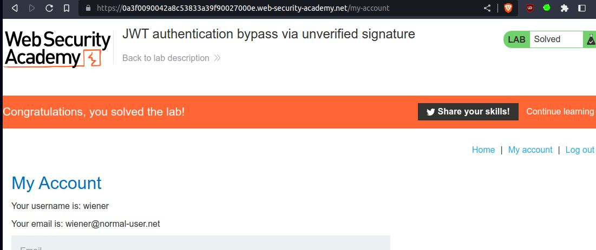

# JWT authentication bypass via unverified signature

## This lab uses a JWT-based mechanism for handling sessions. Due to implementation flaws, the server doesn't verify the signature of any JWTs that it receives.

## To solve the lab, modify your session token to gain access to the admin panel at `/admin`, then delete the user `carlos`.

## You can log in to your own account using the following credentials: `wiener:peter`

##### NOTE: install jwt editor extension in burp-suite

### basic information about jwt

- header section in red`
- payload section in pink
- signature section in sky blue

---

step 1

login to account on /my-account section you will see jwt token
send /my-account to repeater send request you will get 200 ok

step 2
in payload section just change wiener to admin
but unfortunately you will not get admin panel

step 3
now this time try with administrator
you will get admin panel

to get account details you need admin page

step 4
once you send request with /admin you will get carlos and wiener account deleting option
note: token is modified with payload administrator

step 5
to solve the lab delete carlos account
just send GET request to `/admin/delete?username=carlos` to delete carlos account
you will get 302 found

