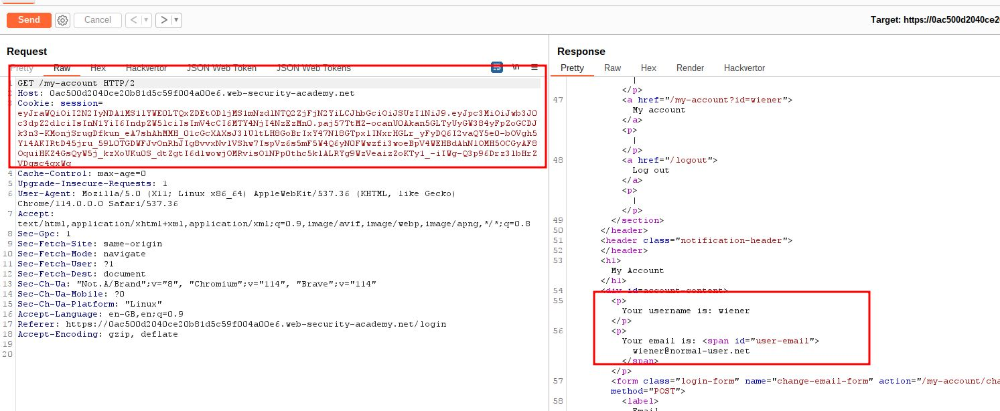
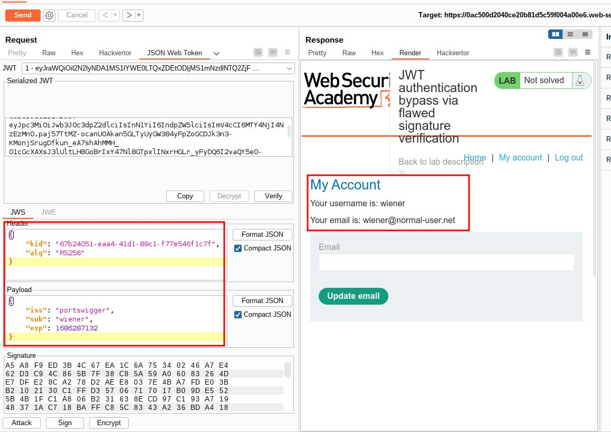
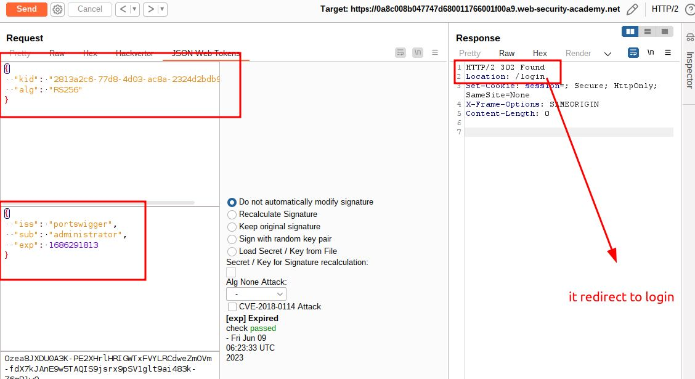
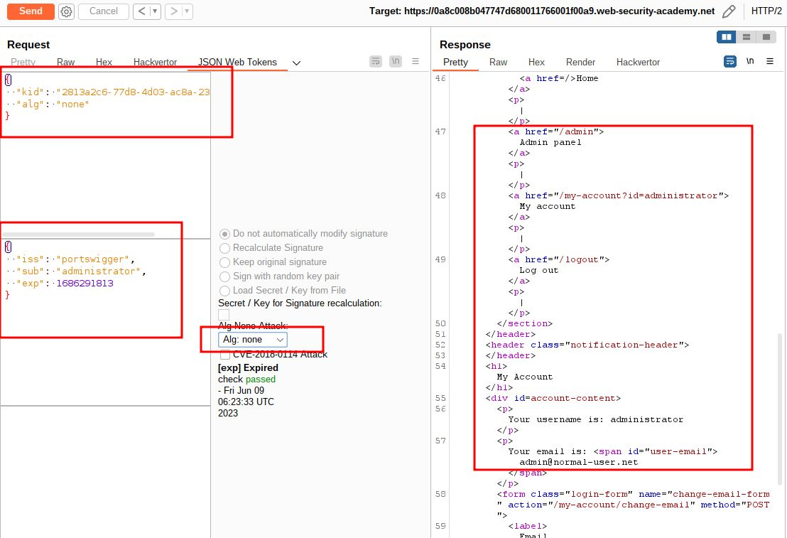
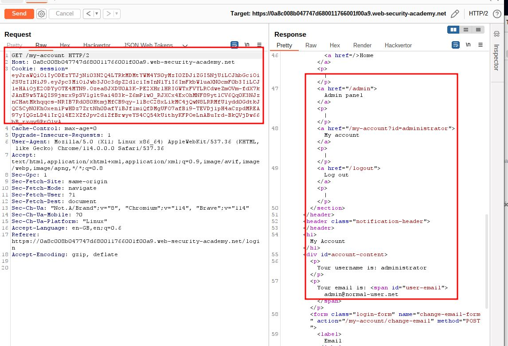
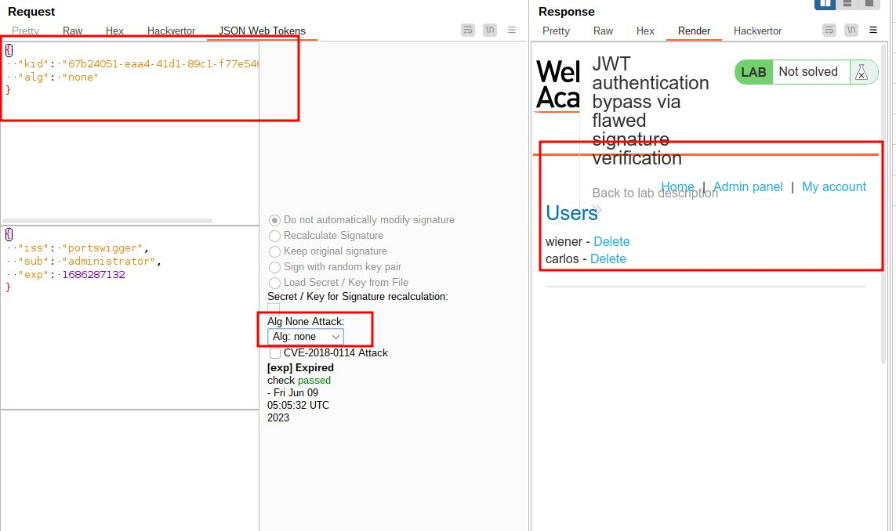
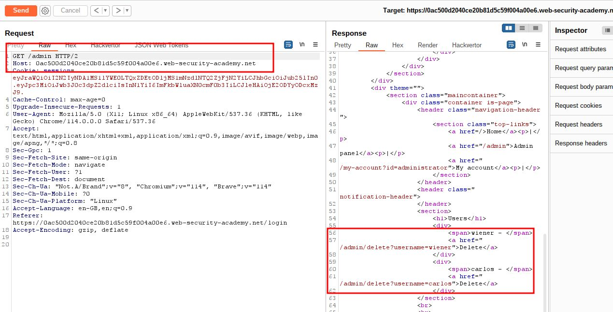
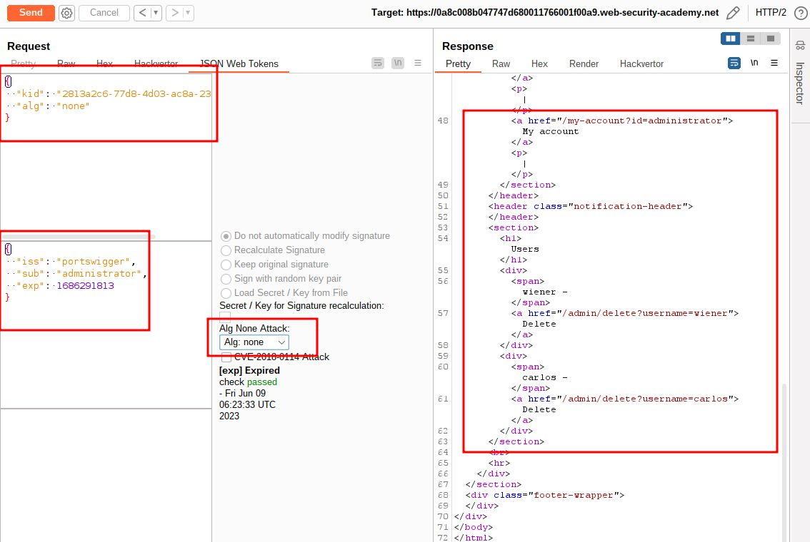
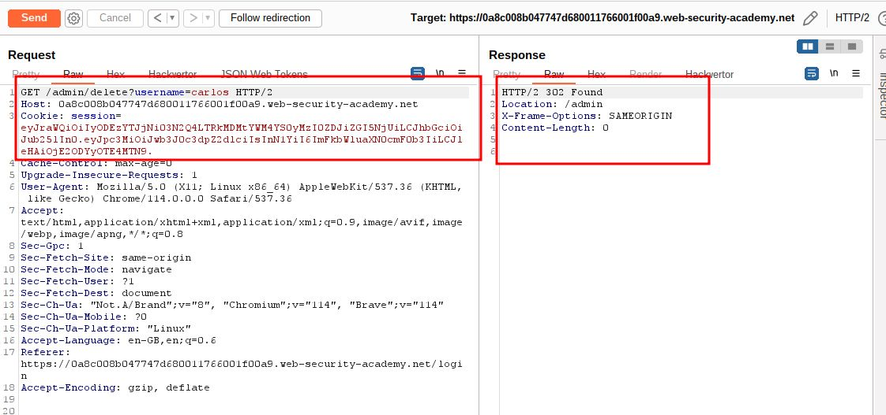
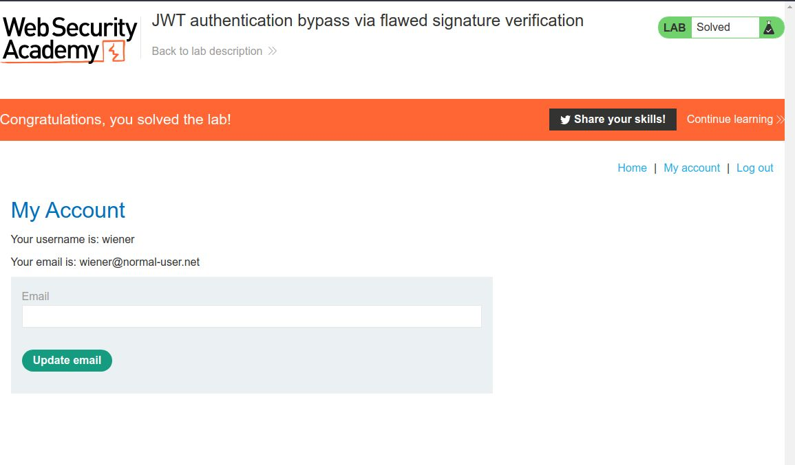

# JWT authentication bypass via flawed signature verification

## This lab uses a JWT-based mechanism for handling sessions. The server is insecurely configured to accept unsigned JWTs.

## To solve the lab, modify your session token to gain access to the admin panel at `/admin`, then delete the user `carlos`.

## You can log in to your own account using the following credentials: `wiener:peter`

---

step 1

login to account send /my-account to repeater

step 2
use user administrator in sub send request
you will get 302 found which is successful
but location /login

step 3
use sub as administrator
Alg:none
send request

step 4

now change to /admin and send request

make sure alg : none

step 5
send GET /admin/delete?username=carlos

