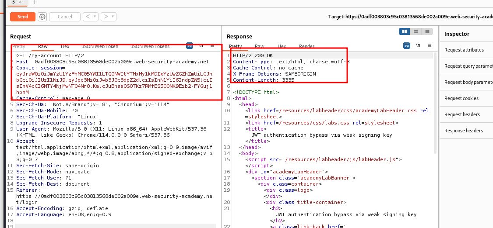
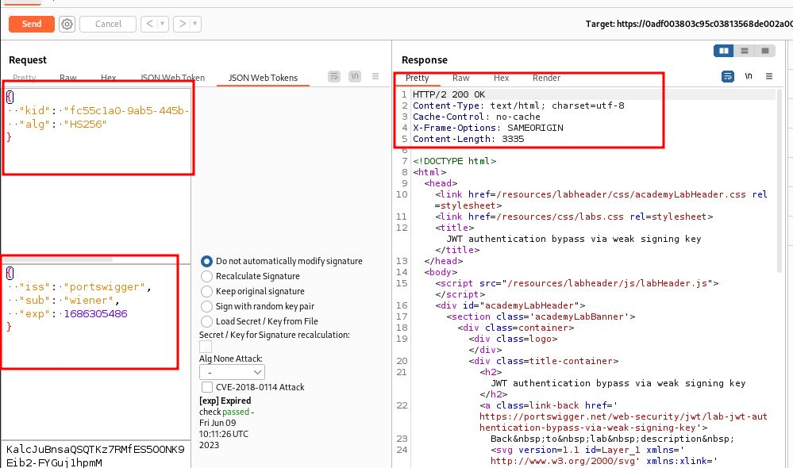
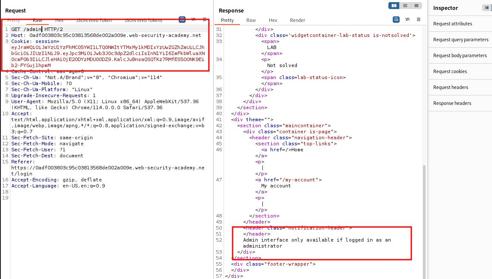
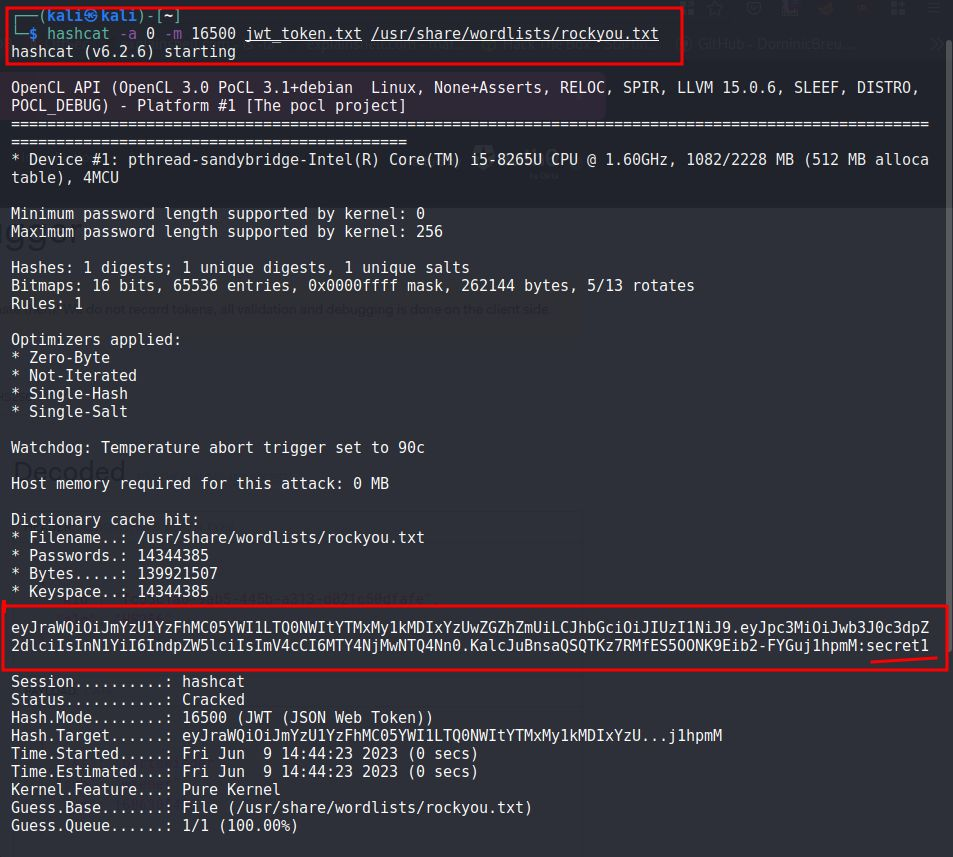
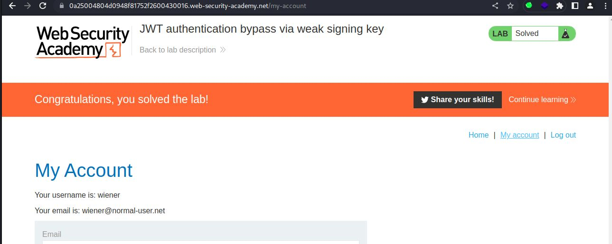

# JWT authentication bypass via weak signing key

## This lab uses a JWT-based mechanism for handling sessions. It uses an extremely weak secret key to both sign and verify tokens. This can be easily brute-forced using a [wordlist of common secrets](https://github.com/wallarm/jwt-secrets/blob/master/jwt.secrets.list).

## To solve the lab, first brute-force the website's secret key. Once you've obtained this, use it to sign a modified session token that gives you access to the admin panel at `/admin`, then delete the user `carlos`.

## You can log in to your own account using the following credentials: `wiener:peter`

---

step 1

login to my-account and send to repeater
send request

step 2

try to access admin send request
you get unauthorized
Admin interface only available if logged in as administrator

step 3

store token to in a file
using hashcat decode secret key
`hashcat -a 0 -m 16500 jwt_token.txt /usr/share/wordlists/rockyou.txt`
you will get secret key `secret1`

step 5

now modify json web token
payload administrator send request you will get 302 found but location is /login
it means not able to access admin

step 6
decode `secrect1` to base64 `c2VjcmV0MQ==`

step 7

go to jwt editor keys
click on new symmetric key
click on gernarate

replace k with base64 key `c2VjcmV0MQ==`
click ok

step 8

click on jsonweb token tab
sub must be administrator
click to sign a pop up will come click on don't modify header
click ok you will notice jwt modifed after this step

step 9
click on raw tab
send GET request to /admin

---

step 10

send GET /admin/delete?username=carlos request to solve lab

