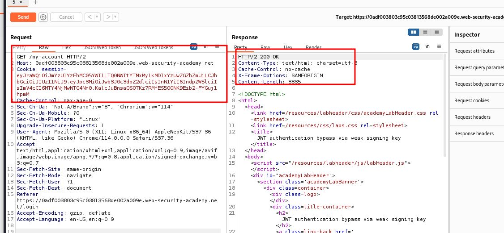
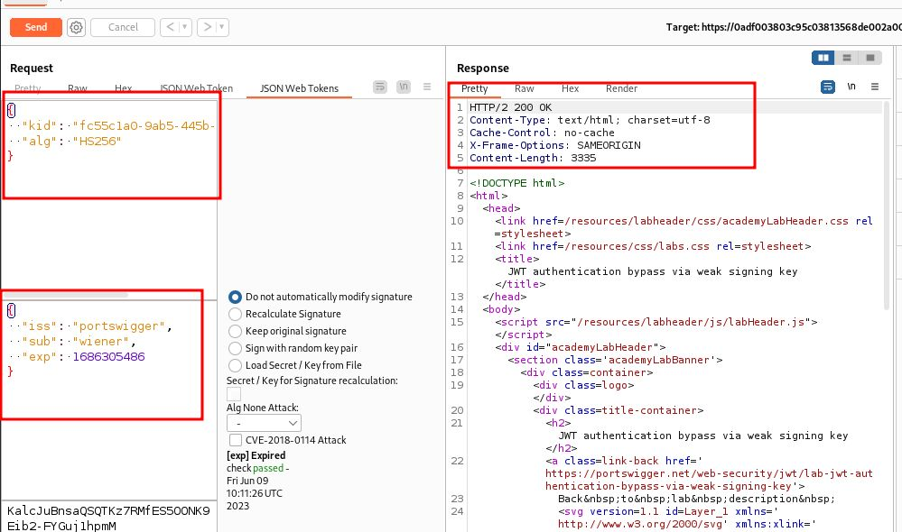
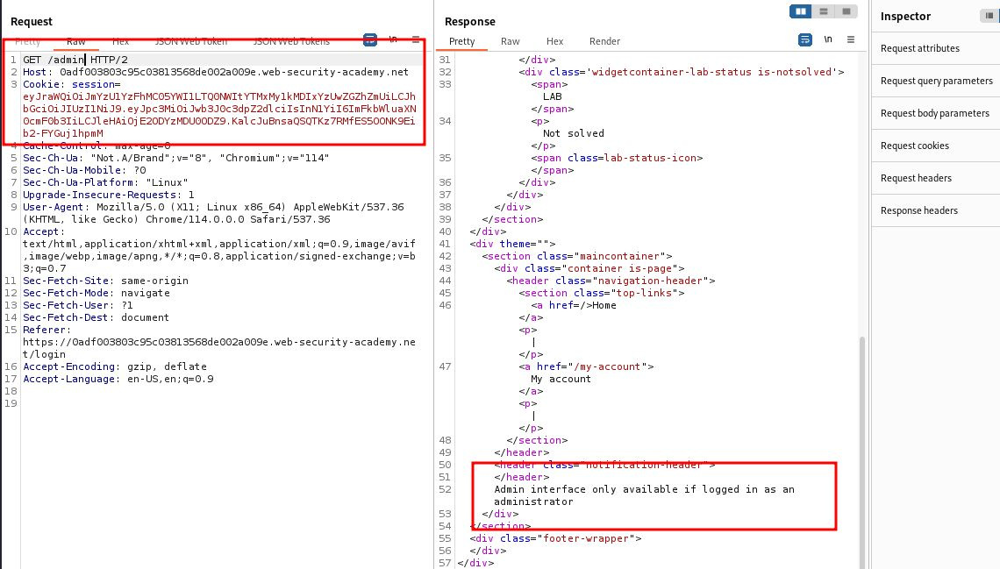
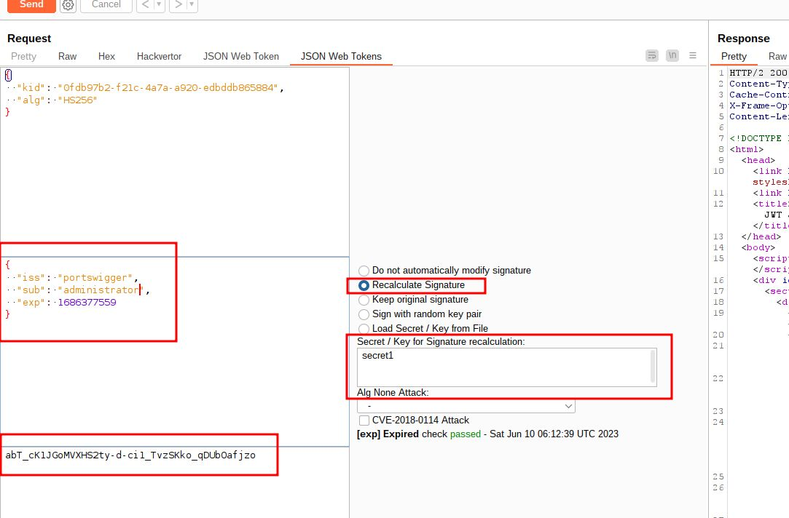
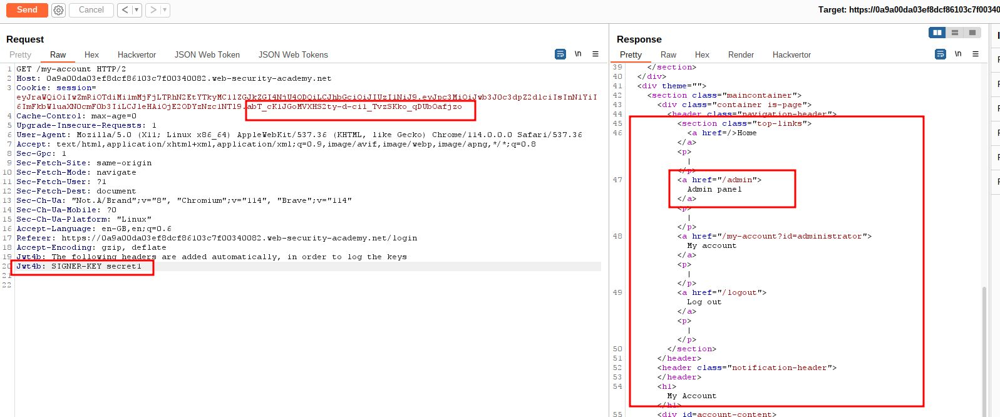
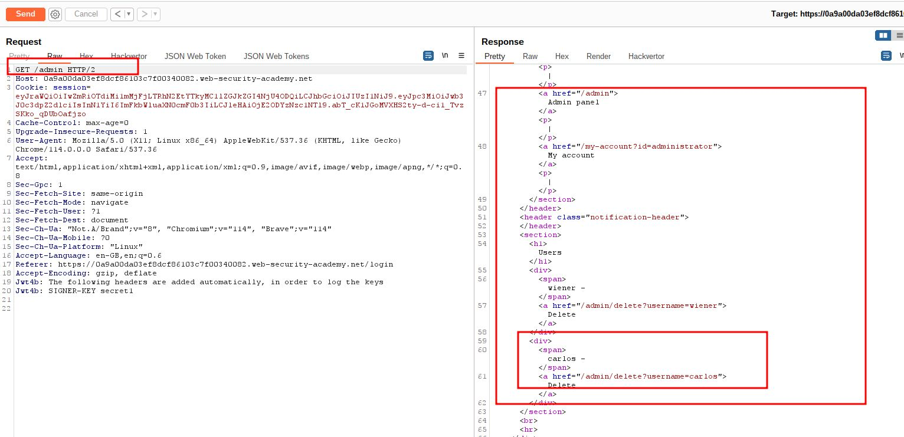
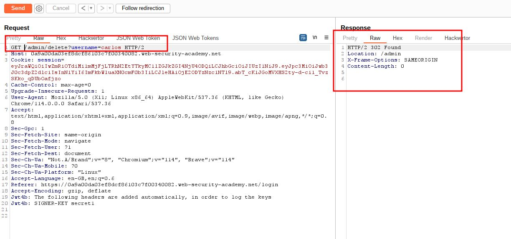
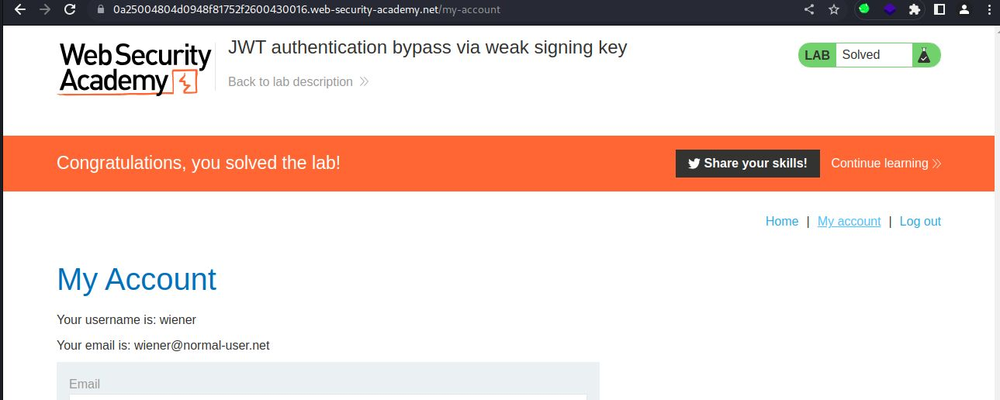

# JWT authentication bypass via weak signing key

## This lab uses a JWT-based mechanism for handling sessions. It uses an extremely weak secret key to both sign and verify tokens. This can be easily brute-forced using a [wordlist of common secrets](https://github.com/wallarm/jwt-secrets/blob/master/jwt.secrets.list).

## To solve the lab, first brute-force the website's secret key. Once you've obtained this, use it to sign a modified session token that gives you access to the admin panel at `/admin`, then delete the user `carlos`.

## You can log in to your own account using the following credentials: `wiener:peter`

##### Note: josn web tokens extension used

---

step 1

login to my-account and send to repeater
send request

step 2

try to access admin send request
you get unauthorized
Admin interface only available if logged in as administrator

step 3

store token to in a file
using hashcat decode secret key
`hashcat -a 0 -m 16500 jwt_token.txt /usr/share/wordlists/rockyou.txt`
you will get secret key `secret1`

step 4

go to json web tokens tabs
click on recalculate signature
change sub as administrator
you will notice a new signature generated

newly generated signature is replace with old signature
now send request you will get 200 ok and you will login as administrator

step 5

send GET request to /admin

step 6
send GET /admin/delete?username=carlos request to solve lab

