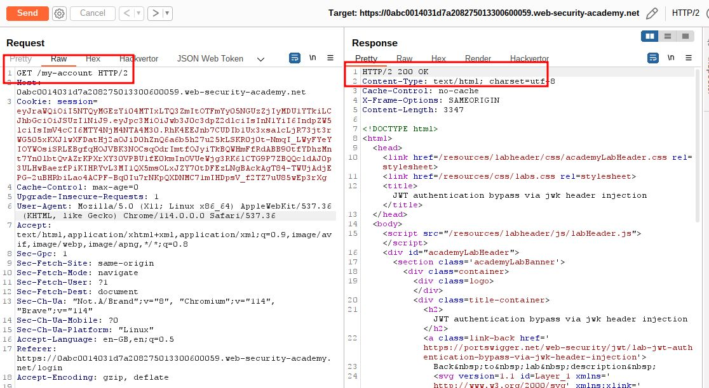
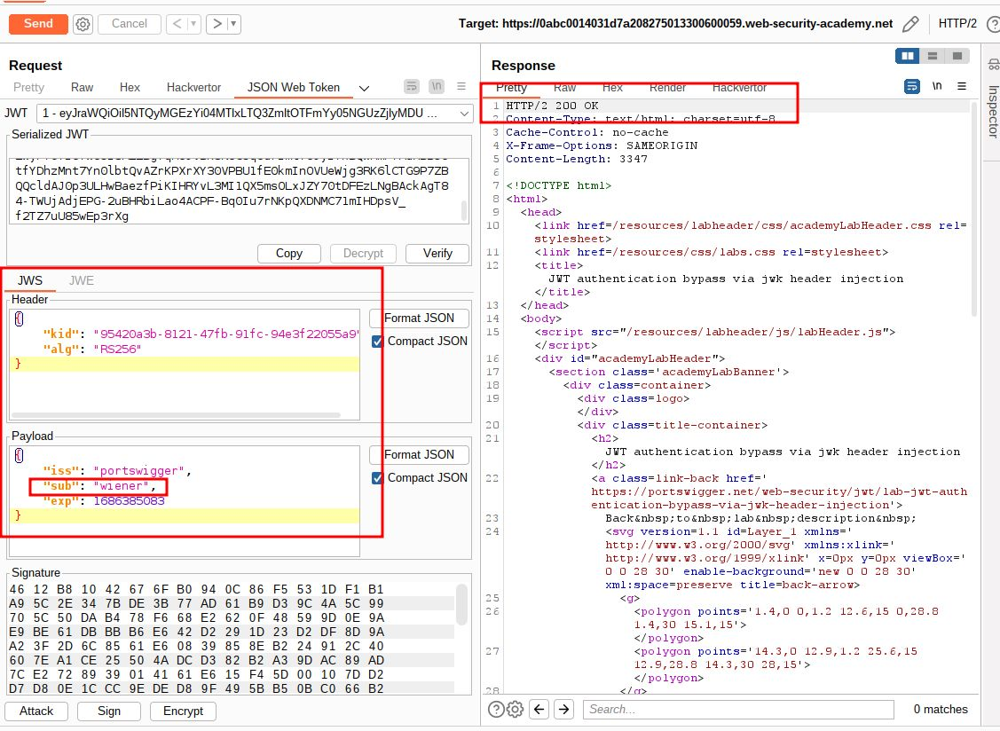
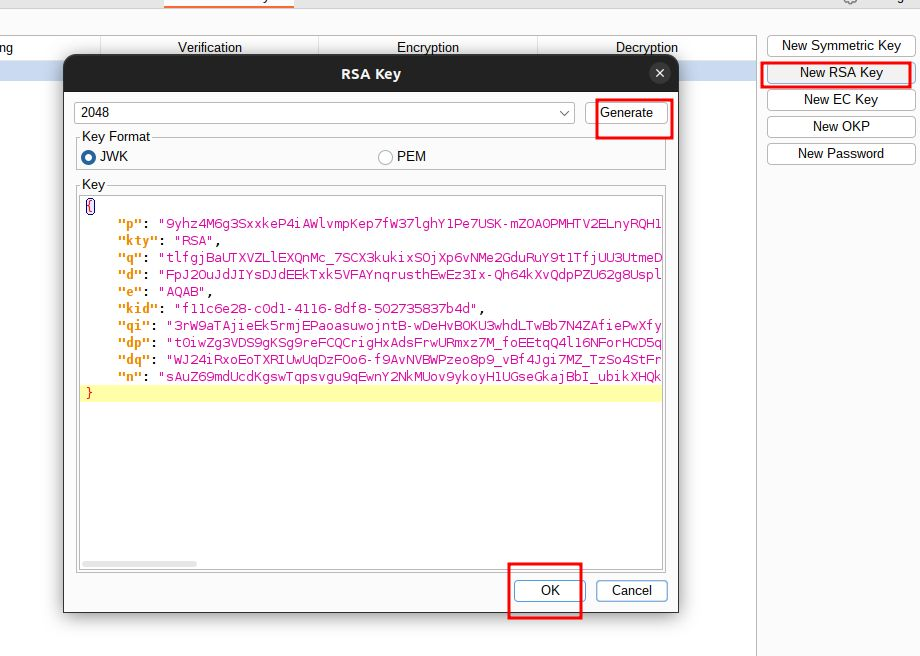
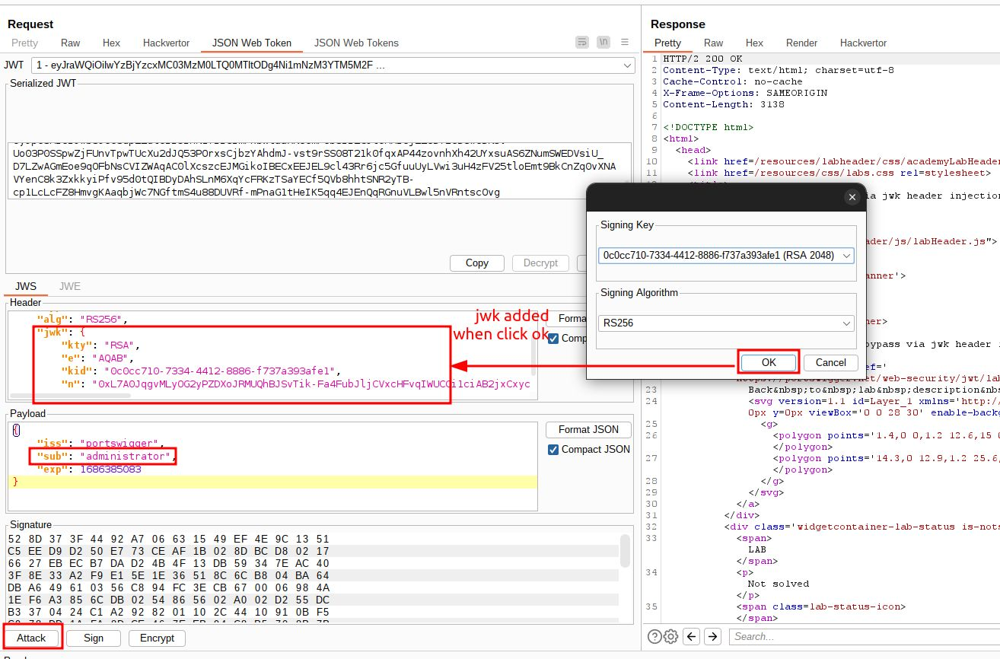
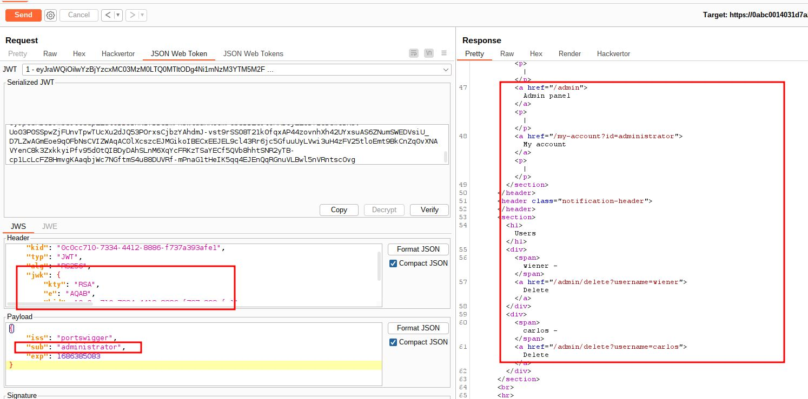
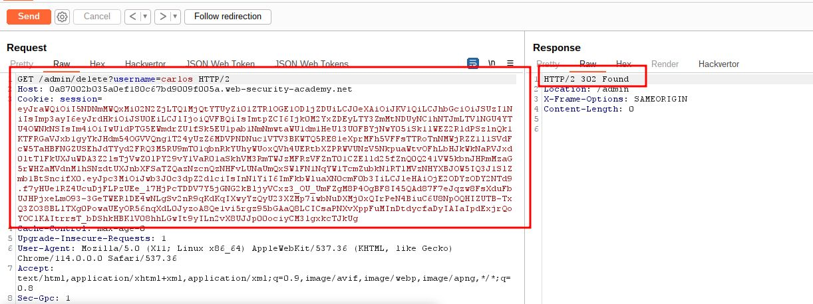
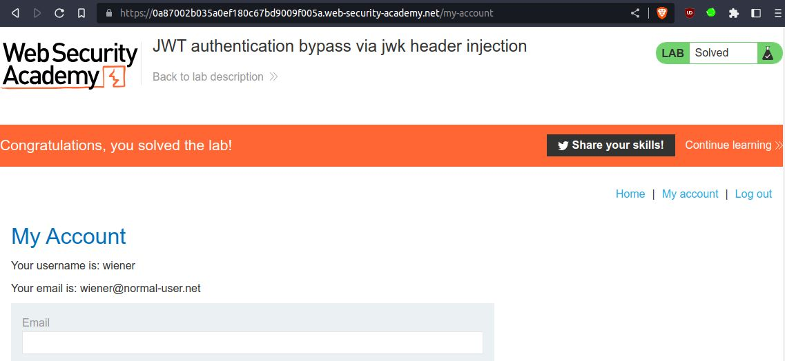

# JWT authentication bypass via jwk header injection

## This lab uses a JWT-based mechanism for handling sessions. The server supports the `jwk` parameter in the JWT header. This is sometimes used to embed the correct verification key directly in the token. However, it fails to check whether the provided key came from a trusted source.

## To solve the lab, modify and sign a JWT that gives you access to the admin panel at `/admin`, then delete the user `carlos`.

## You can log in to your own account using the following credentials: `wiener:peter`

---

step 1

login in to account send to repeater

click on json web token tab for header and payload

step 2

step 3
in sub replace wiener with administrator
at the bottom click on attack click on embedded jwk
click on ok
you will notice jwk added into payload

send request 200k

when you will get 200 ok go to bottom
you will see admin panel and wiener and carlos account delete operation

step 4

send GET /admin/delete?username=carlos request to solve lab

