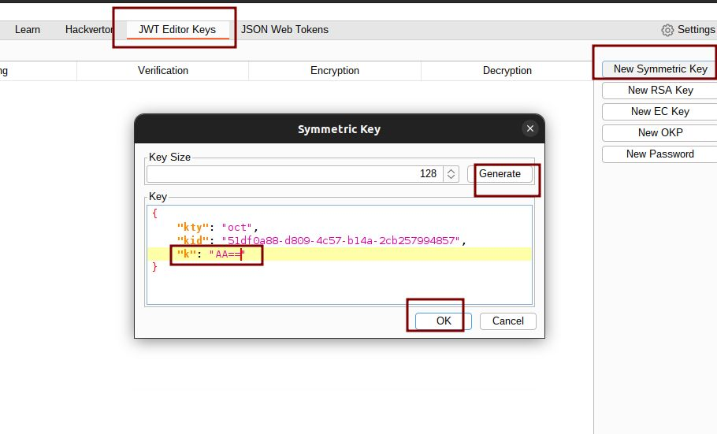
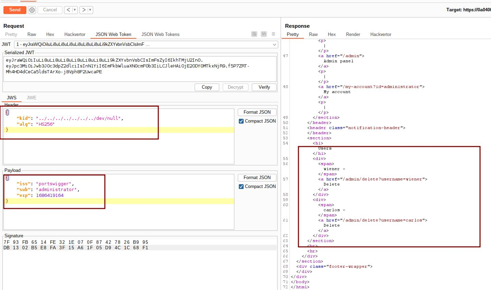

# WT authentication bypass via kid header path traversal

## This lab uses a JWT-based mechanism for handling sessions. In order to verify the signature, the server uses the `kid` parameter in JWT header to fetch the relevant key from its filesystem.

## To solve the lab, forge a JWT that gives you access to the admin panel at `/admin`, then delete the user `carlos`.

## You can log in to your own account using the following credentials: `wiener:peter`

---

step 1

login into account
send my account to repeater
you will get 200 response

step 2

change my account to /admin and send request
you will get 401 unauthorized

this is json web token tab where sub is modified with administrator

step 3
click on jwt editor keys
click on new symmetric key
add k as `AA==` is null byte encoder

step 4

header portion ` "kid": "../../../../../../../dev/null"` to get 200 ok
sub as administrator
click on sign in don't modify header click ok
send request 200 ok
note you can test header portion with ` "kid": "../../dev/null"` or ` "kid": "../../../../dev/null"` untill you get 200 response

once you will get 200 ok
at the bottom you will get admin panel
Note admin panel only show when GET /admin request

step 5

send GET /admin/delete?username=carlos request to solve lab

