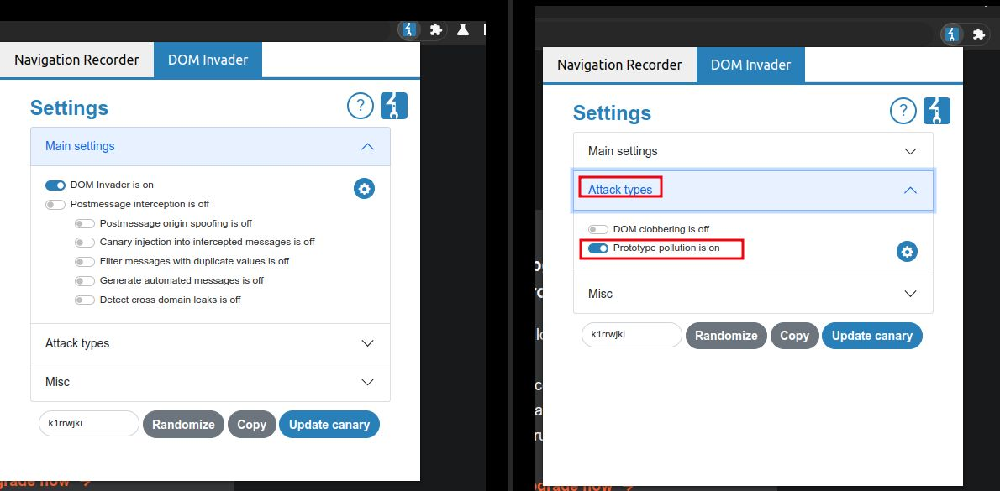

# Client-side prototype pollution in third-party libraries

## This lab is vulnerable to [DOM XSS](https://portswigger.net/web-security/cross-site-scripting/dom-based) via client-side [prototype pollution](https://portswigger.net/web-security/prototype-pollution). This is due to a gadget in a third-party library, which is easy to miss due to the minified source code. Although it's technically possible to solve this lab manually, we recommend using [DOM Invader](https://portswigger.net/burp/documentation/desktop/tools/dom-invader/prototype-pollution) as this will save you a considerable amount of time and effort.

To solve the lab:

1. Use DOM Invader to identify a prototype pollution and a gadget for DOM [XSS](https://portswigger.net/web-security/cross-site-scripting).
    
2. Use the provided exploit server to deliver a payload to the victim that calls `alert(document.cookie)` in their browser.
    
This lab is based on real-world vulnerabilities discovered by PortSwigger Research. For more details, check out [Widespread prototype pollution gadgets](https://portswigger.net/research/widespread-prototype-pollution-gadgets) by [Gareth Heyes](https://portswigger.net/research/gareth-heyes).


---

step 1

open burpsuite go to proxy section open browser
click on extension icon 
in main settings on Dom Invader and in attack types prototype pollution is on




step 2

open dev tools click on DOM Invader
click on scan for gadgets


step 3

from step 2 once you click on scan for gadgets you will redirect to new tab where you will see scanning start
once scanning finished  open dev tools again you will see exploit option in DOM invader
click on exploit


step 4

from step 3 once you click on exploit you will get alert pop up


step 5

`/#__proto__[testproperty]=proto__[hitCallback]=alert%281%29`
to solve the lab Use the provided exploit server to deliver a payload to the victim that calls `alert(document.cookie)` in their browser.
`/#__proto__[testproperty]=proto__[hitCallback]=alert%28document.cookie%29`

add payload into exploit

```javascript
<script>
location="https://0a6200b7046dc61582c2bf5900f20062.web-security-academy.net/#__proto__[hitCallback]=alert%28document.cookie%29"
</script>
```


when you click on view exploit
you will get alert pop up


step 6

to solve the lab click Deliver exploit to victim


