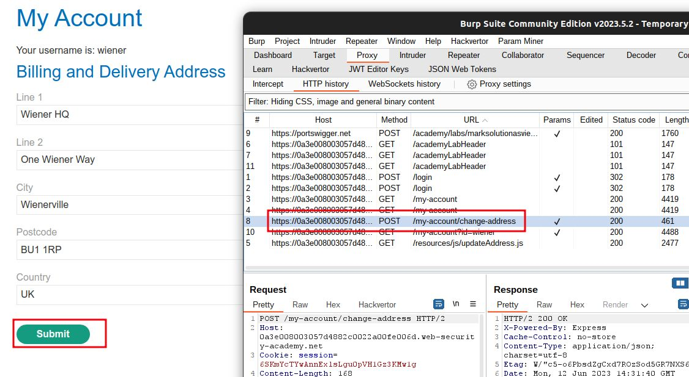
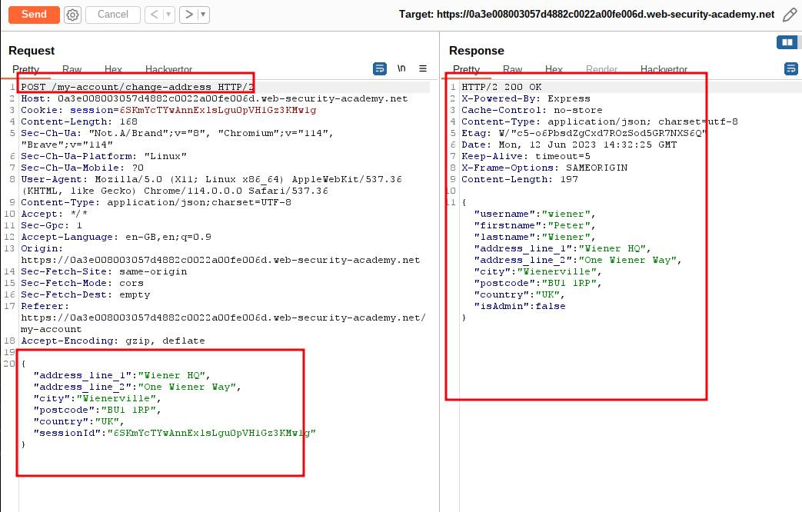
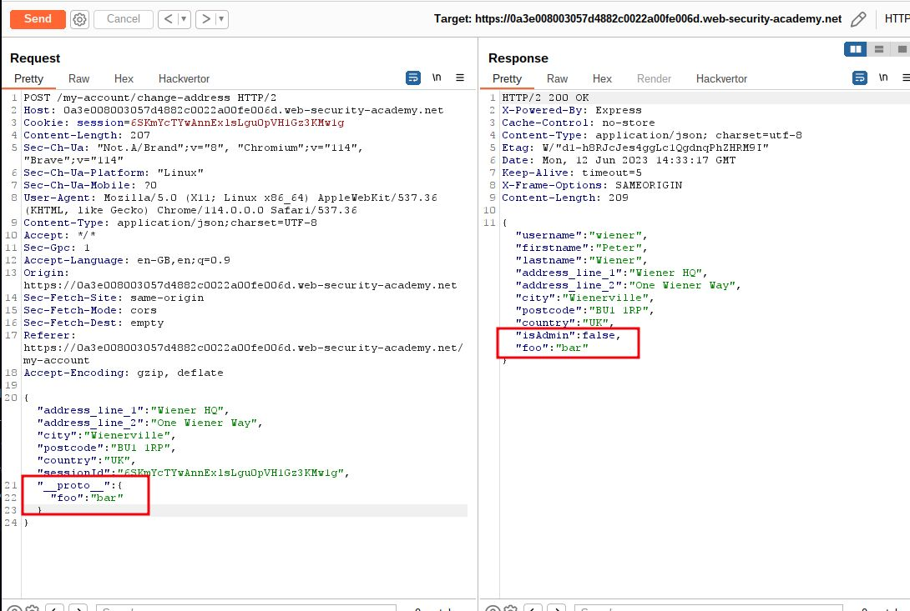
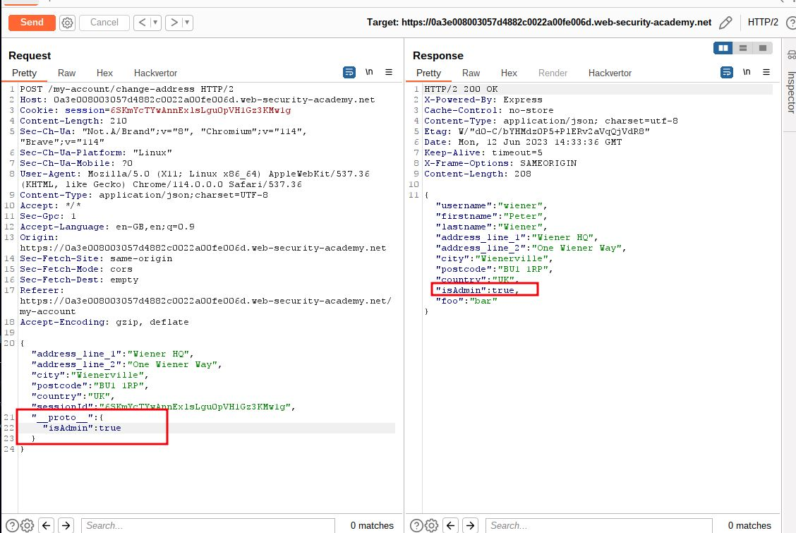
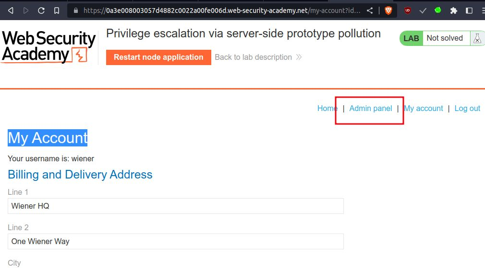
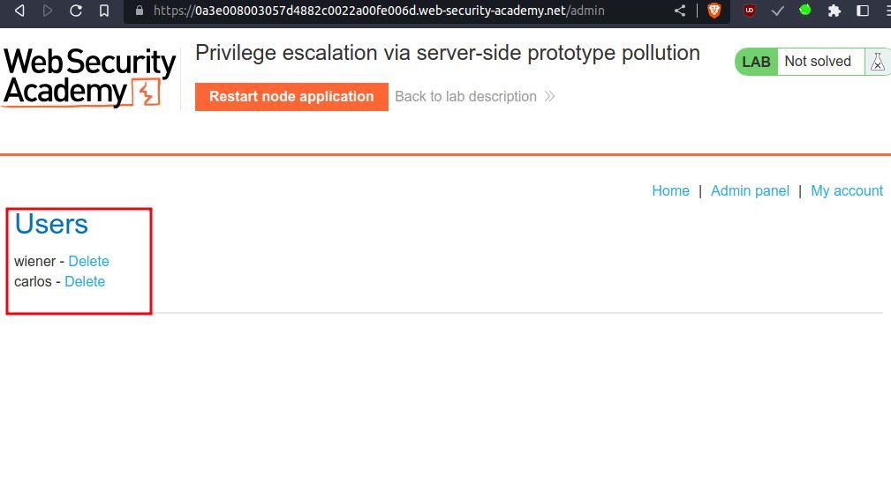
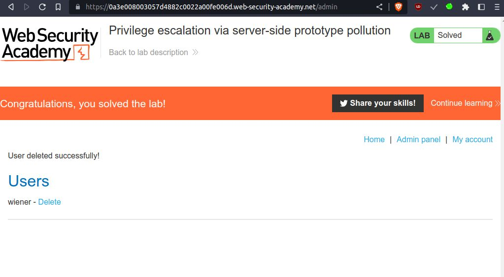

# Privilege escalation via server-side prototype pollution

## This lab is built on Node.js and the Express framework. It is vulnerable to server-side [prototype pollution](https://portswigger.net/web-security/prototype-pollution) because it unsafely merges user-controllable input into a server-side JavaScript object. This is simple to detect because any polluted properties inherited via the prototype chain are visible in an HTTP response.

To solve the lab:

1. Find a prototype pollution source that you can use to add arbitrary properties to the global `Object.prototype`.
2. Identify a gadget property that you can use to escalate your privileges.
3. Access the admin panel and delete the user `carlos`.

You can log in to your own account with the following credentials: `wiener:peter`

___

step 1

login to account you will get my account with Billing and Delivery address
when you click submit in burpsuite you will get `/my-account/change-address`
send to the repeater



step 2

send request you will get json object with all information



step 3

add a new property to the JSON with the name `__proto__`, containing an object with an arbitrary property:

```
"__proto__": {
    "foo":"bar"
}
```



step 4

add payload  with property `"isAdmin":true`

```
"__proto__": {
    "isAdmin":true
}
```



step 5

reload home page you will get Admin panel




step 6

Delete carlos account to solve lab




