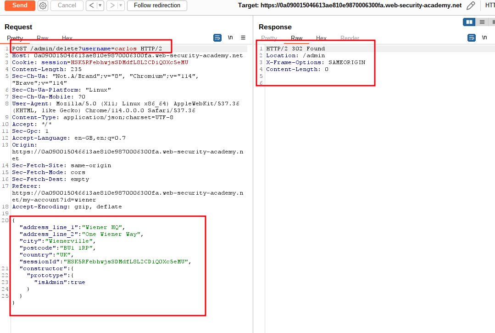

# Bypassing flawed input filters for server-side prototype pollution

## This lab is built on Node.js and the Express framework. It is vulnerable to server-side [prototype pollution](https://portswigger.net/web-security/prototype-pollution) because it unsafely merges user-controllable input into a server-side JavaScript object.

To solve the lab:

1. Find a prototype pollution source that you can use to add arbitrary properties to the global `Object.prototype`.
2. Identify a gadget property that you can use to escalate your privileges.
3. Access the admin panel and delete the user `carlos`.

You can log in to your own account with the following credentials: `wiener:peter`

___

step 1

login to account, you will see Billing and Delivery Address click submit
you will get `/my-account/change-address`
send to repeater


step 2
use json space


add a new property to the JSON with the name `__proto__`, containing an object with a `json spaces` property.
```
"__proto__": {
 "json spaces":10
}
```


step 3

Modify the request to try polluting the prototype via the `constructor` property instead
you will notice in response tab `"json space": 10` added in json file
```
"constructor":{
	"__proto__": {
	 "json spaces":10
	}
}
```


step 4

Modify the request to try polluting the prototype with your own `isAdmin` property:
you will notice in response tab `"isAdmin": true` added in json file
```
"constructor":{
	"__proto__": {
	 "isAdmin":true
	}
}
```


step 5
try to access `/admin` 
you will get admin panel 


step 6

delete carlos account to solve lab




